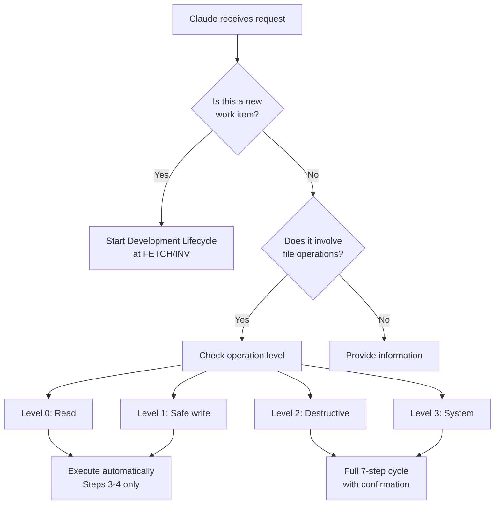

# Proposed Documentation Improvements for Claude Integration System

## Overview

This document proposes sophisticated solutions to improve the clarity and usability of the Claude integration system while maintaining its robust safety mechanisms and dual-process architecture.

## 1. Core Issue: The "Two 7s" Confusion

### Current State
- Two distinct "7-step/phase" processes exist
- Their relationship is unclear
- Documentation is scattered across multiple files
- New users struggle to understand which process applies when

### Root Cause
The system evolved to serve two different needs:
1. **Strategic**: Managing complete work items (7-phase lifecycle)
2. **Tactical**: Ensuring safe operations (7-step cycle)

Both are necessary but their interaction is poorly documented.

## 2. Proposed Solution: The "Nested Cycles" Model

### 2.1 Conceptual Framework

```
┌─────────────────────────────────────────────────────────┐
│                  DEVELOPMENT LIFECYCLE                   │
│                    (Strategic Level)                     │
│                                                         │
│  FETCH → INV → ANA → PLAN → BUILD → VERIF → REL       │
│                              │                          │
│                              ▼                          │
│                   ┌─────────────────────┐              │
│                   │  EXECUTION CYCLE    │              │
│                   │  (Tactical Level)   │              │
│                   │                     │              │
│                   │  For each operation:│              │
│                   │  1. BACKUP          │              │
│                   │  2. CONFIRM         │              │
│                   │  3. EXECUTE         │              │
│                   │  4. VERIFY          │              │
│                   │  5. EVALUATE        │              │
│                   │  6. UPDATE          │              │
│                   │  7. CLEANUP         │              │
│                   └─────────────────────┘              │
└─────────────────────────────────────────────────────────┘
```

### 2.2 Clear Terminology

**Development Phases** (Strategic):
- Purpose: Manage work items from start to finish
- Scope: Entire feature/bug/issue
- Duration: Hours to days
- Notation: UPPERCASE (FETCH, BUILD, etc.)

**Execution Steps** (Tactical):
- Purpose: Ensure safe individual operations
- Scope: Single file operation
- Duration: Seconds to minutes
- Notation: Numbered steps (Step 1: Backup, etc.)

## 3. Documentation Restructuring

### 3.1 New Entry Point: `.claude/README.md`

```markdown
# Claude Integration System

Welcome to the Claude integration system for the Obsidian Feed Reader project.

## 🚀 Quick Start

### For Development Work
If you're working on an issue, feature, or bug:
→ See [Development Lifecycle Guide](docs/guides/development-lifecycle.md)

### For File Operations
If you're performing file operations within Claude:
→ See [Execution Cycle Guide](docs/guides/execution-cycle.md)

## 📚 Understanding the System

This system uses two complementary processes:

1. **Development Lifecycle** - How we manage work items (issues, features, bugs)
2. **Execution Cycle** - How we ensure safe file operations

→ See [Understanding the Two Processes](docs/concepts/dual-process-model.md)

## 🛡️ Safety First

All operations go through safety validation:
- Level 0-1: Automatic (read/safe write)
- Level 2-3: Requires confirmation (delete/system)

→ See [Safety Mechanisms](docs/concepts/safety-model.md)
```

### 3.2 Unified Concepts Document

Create `.claude/docs/concepts/dual-process-model.md`:

```markdown
# Understanding the Dual Process Model

## The Challenge

When AI assists with development, two types of structure are needed:
1. **Project structure** - Managing work from idea to deployment
2. **Operation safety** - Ensuring each action is safe and reversible

## Our Solution: Nested Processes

### The Outer Loop: Development Lifecycle

Think of this as your project roadmap:
- **FETCH**: Gather requirements and resources
- **INV**: Investigate the problem
- **ANA**: Analyze root causes
- **PLAN**: Design the solution
- **BUILD**: Implement the changes
- **VERIF**: Test and validate
- **REL**: Release to users

### The Inner Loop: Execution Cycle

During BUILD (and other phases), each operation follows safety steps:
1. **Backup**: Save current state
2. **Confirm**: Get approval if needed
3. **Execute**: Perform the operation
4. **Verify**: Check it worked
5. **Evaluate**: Assess success
6. **Update**: Log progress
7. **Cleanup**: Remove temporary files

### How They Work Together

```
Development: ... → PLAN → BUILD → VERIF → ...
                           │
                           ├─→ Edit file A (7-step cycle)
                           ├─→ Create file B (7-step cycle)
                           └─→ Delete file C (7-step cycle)
```

Each file operation in BUILD triggers the execution cycle automatically.
```

## 4. Improved CLAUDE.md Structure

### 4.1 Restructure for Clarity

```markdown
# CLAUDE.md - Claude Integration Guide

## 🎯 Purpose

This guide helps Claude (AI assistant) work safely and effectively with this codebase through two complementary processes.

## 🔄 The Two Processes

### Process 1: Development Lifecycle (Managing Work)
**When**: Working on issues, features, or bugs
**What**: 7 phases from problem to solution
**Details**: See [Development Lifecycle](docs/guides/development-lifecycle.md)

### Process 2: Execution Cycle (Safe Operations)
**When**: Performing any file operation
**What**: 7 steps ensuring safety and auditability
**Details**: See below and [Execution Cycle](docs/guides/execution-cycle.md)

## 🛡️ Mandatory Safety Protocol

[Keep existing safety sections but clarify they apply to execution cycle]
```

## 5. Visual Improvements

### 5.1 Interactive Process Diagram

Create an interactive SVG diagram that:
- Shows both processes clearly
- Highlights current position
- Clicking on elements shows details
- Color codes by safety level

### 5.2 Decision Flow Chart



## 6. Tooling Improvements

### 6.1 Unified Status Command

```bash
# Create claude-status command that shows:
$ claude-status

Current Development Phase: BUILD
  ├─ Task: B-2 (Implementing unit tests)
  ├─ Started: 2 hours ago
  └─ Progress: 60%

Recent Operations:
  ├─ [10:32] ✓ Created test/new-feature.spec.ts (Level 1)
  ├─ [10:35] ✓ Modified src/feature.ts (Level 1)
  └─ [10:37] ⚠ Pending: Delete old-file.ts (Level 2 - awaiting confirmation)

Active Safety Rules:
  ├─ Backup: Enabled (last: 10:37)
  ├─ Confirmation: Required for Level 2+
  └─ Audit: Logging to .claude/runtime/audit.log
```

### 6.2 Context-Aware Prompts

Modify operation guard to provide helpful context:

```typescript
class OperationGuard {
  async getConfirmationMessage(operation: string, target: string, context: any): string {
    const phase = this.getCurrentPhase();
    const level = this.getOperationLevel(operation, target);
    
    return `
╔═══════════════════════════════════════════════════════════╗
║                   CONFIRMATION REQUIRED                    ║
╠═══════════════════════════════════════════════════════════╣
║ Current Phase: ${phase}                                    ║
║ Operation: ${operation} (Level ${level})                   ║
║ Target: ${target}                                          ║
║                                                           ║
║ This operation will:                                      ║
║ ${this.describeImpact(operation, target)}                 ║
║                                                           ║
║ Execution cycle steps:                                    ║
║ ✓ 1. Backup created                                       ║
║ → 2. Awaiting your confirmation                           ║
║ ○ 3-7. Will execute after approval                        ║
╠═══════════════════════════════════════════════════════════╣
║ Type 'yes' to proceed or 'no' to cancel:                 ║
╚═══════════════════════════════════════════════════════════╝
    `;
  }
}
```

## 7. Progressive Disclosure Strategy

### 7.1 Layered Documentation

**Layer 1: Quick Start** (New users)
- What problem does this solve?
- How do I start using it?
- Where do I go for help?

**Layer 2: Practical Guides** (Regular users)
- Development lifecycle guide
- Execution cycle guide
- Common scenarios

**Layer 3: Deep Dives** (Power users)
- Complete guard reference
- Custom agent creation
- System architecture

**Layer 4: Implementation** (Maintainers)
- Code architecture
- Extension points
- Test strategies

### 7.2 Smart Defaults

Configure the system to adapt based on context:

```json
{
  "profiles": {
    "development": {
      "enforce_full_lifecycle": true,
      "execution_cycle_mode": "strict"
    },
    "maintenance": {
      "enforce_full_lifecycle": false,
      "execution_cycle_mode": "smart"
    },
    "emergency": {
      "enforce_full_lifecycle": false,
      "execution_cycle_mode": "minimal",
      "require_approval": true
    }
  }
}
```

## 8. Educational Improvements

### 8.1 Interactive Tutorial

Create `.claude/tutorial/` with step-by-step examples:

```bash
# Tutorial 1: Your First Issue
claude-tutorial start first-issue

This will guide you through:
1. Starting with FETCH phase
2. Creating investigation notes
3. Writing an RFC
4. Making changes with safety
5. Testing and verification
6. Creating a release
```

### 8.2 Scenario-Based Learning

Provide real examples:

```markdown
## Scenario: Fixing a Bug

You've been assigned issue #42: "Feed items disappear on refresh"

### Step 1: Start the Lifecycle
```bash
claude-cli start issue-42-feed-refresh-bug
```

### Step 2: Investigation Phase
The system guides you to:
- Reproduce the issue (INV)
- Analyze the cause (ANA)
- Plan the fix (PLAN)

### Step 3: Implementation
During BUILD, each operation automatically uses the execution cycle...
```

## 9. Monitoring and Feedback

### 9.1 Usage Analytics

Track (anonymously) which parts cause confusion:
- Where do users get stuck?
- Which errors are most common?
- What documentation is most viewed?

### 9.2 Continuous Improvement

Create feedback mechanism:

```bash
# After each major operation
claude-cli feedback

How was your experience? (1-5): 4
What was confusing?: The difference between VERIF and VERIFY
Suggestion?: Use different terms to avoid confusion
```

## 10. Implementation Roadmap

### Phase 1: Documentation (Week 1)
- [ ] Create unified README
- [ ] Write dual-process guide
- [ ] Standardize terminology
- [ ] Add visual diagrams

### Phase 2: Tooling (Week 2)
- [ ] Implement claude-status command
- [ ] Enhance operation guard messages
- [ ] Create context detection
- [ ] Add progress tracking

### Phase 3: Education (Week 3)
- [ ] Build interactive tutorial
- [ ] Write scenario guides
- [ ] Create video walkthrough
- [ ] Add inline help

### Phase 4: Refinement (Week 4)
- [ ] Gather user feedback
- [ ] Refine based on usage
- [ ] Optimize common paths
- [ ] Document edge cases

## Conclusion

These improvements maintain the system's robust safety features while dramatically improving usability. The key insights are:

1. **Clear separation**: The two processes serve different needs
2. **Visual clarity**: Diagrams and examples reduce confusion
3. **Progressive disclosure**: Users learn what they need when they need it
4. **Smart assistance**: The system helps rather than hinders

By implementing these changes, the Claude integration system can become a model for how AI assistants can safely and effectively work with codebases.

---

*Document created: 2025-01-06*
*Author: Claude (Analysis Agent)*