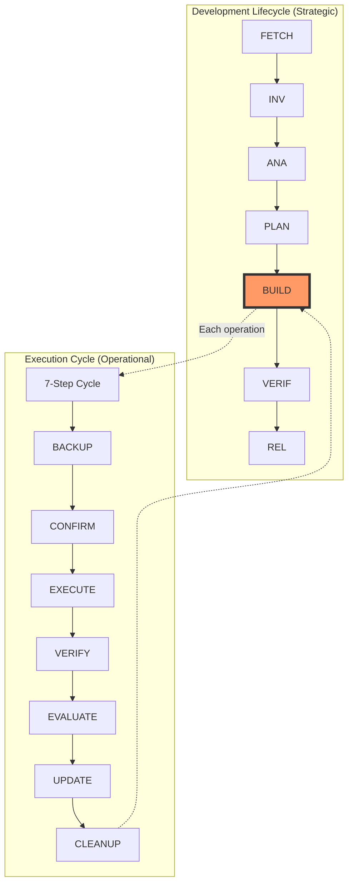

# Claude Integration System Architecture Analysis

## Executive Summary

The Claude integration system in this repository implements a sophisticated dual-process architecture with extensive safety mechanisms, automated validation, and structured workflows. The system combines a **7-phase development lifecycle** for managing work items with a **7-step execution cycle** for ensuring safe operations. This analysis reveals the core philosophy, identifies key issues, and proposes solutions for improving system clarity.

## 1. System Philosophy and Core Design

### 1.1 Dual Process Architecture

The system implements two complementary but distinct processes:

1. **Development Lifecycle (Strategic Level)**
   - 7 phases: FETCH → INV → ANA → PLAN → BUILD → VERIF → REL
   - Manages work items from inception to release
   - Enforces structured development with clear deliverables
   - Lives in `docs/agents/01_task-lifecycle.md`

2. **Execution Cycle (Operational Level)**
   - 7 steps: BACKUP → CONFIRM → EXECUTE → VERIFY → EVALUATE → UPDATE → CLEANUP
   - Ensures safety for individual operations
   - Mandatory for all file operations based on security level
   - Defined in `CLAUDE.md` and enforced by `.mcp/operation-guard.ts`

### 1.2 Core Philosophy

The system embodies several key principles:

1. **Safety First**: Every operation must go through appropriate validation
2. **Auditability**: All actions are logged and traceable
3. **Repeatability**: Structured processes ensure consistent outcomes
4. **Transparency**: Clear documentation of state transitions and decisions
5. **Fail-Safe**: Multiple layers of guards and validation

## 2. System Components and Their Roles

### 2.1 Documentation Layer

- **CLAUDE.md**: Primary integration guide, defines execution cycle
- **AGENTS.md**: Multi-agent system overview, references development lifecycle
- **docs/agents/**: Detailed agent specifications and workflows
- **.claude/docs/**: Claude-specific documentation and standards

### 2.2 Configuration Layer

- **.claude/config/**: Active configuration files
  - `cycle-enforcement.json`: Execution cycle rules
  - `consolidated-safety-rules.json`: Operation permissions
- **docs/templates/claude/**: Template files for new integrations

### 2.3 Implementation Layer

- **.mcp/operation-guard.ts**: Runtime operation validation
- **.claude/scripts/**: Automation scripts for cycle enforcement
- **tools/**: Shell-based validation tools

### 2.4 Workspace Layer

- **.claude/workspace/**: Structured project workspace
- Hierarchy: projects/{name}/{PHASE}/{task}/{process}/
- Git-ignored for active development work

## 3. Process Flow and Integration

### 3.1 Development Lifecycle Flow

```
Issue/Feature Request
    ↓
FETCH (gather resources)
    ↓
INV (investigate/reproduce)
    ↓
ANA (analyze root cause)
    ↓
PLAN (create RFC)
    ↓
BUILD (implement)
    ↓
VERIF (test/validate)
    ↓
REL (release)
```

### 3.2 Execution Cycle Flow (per operation)

```
Operation Request
    ↓
Check Operation Level (0-3)
    ↓
BACKUP (if needed)
    ↓
CONFIRM (if level 2+)
    ↓
EXECUTE
    ↓
VERIFY
    ↓
EVALUATE
    ↓
UPDATE
    ↓
CLEANUP
```

### 3.3 Integration Points

1. **During BUILD phase**: Each file operation triggers execution cycle
2. **Operation Guard**: Validates both cycle compliance and safety rules
3. **GitHub Actions**: Enforce phase transitions and validation
4. **MCP Integration**: Provides enhanced capabilities with safety

## 4. Key Issues Identified

### 4.1 Documentation Confusion

**Issue**: The relationship between the two 7-step processes is not immediately clear.

**Evidence**: 
- CLAUDE.md focuses on execution cycle
- AGENTS.md focuses on development lifecycle
- No clear explanation of how they interact

**Impact**: New users/contributors may confuse the two processes.

### 4.2 Overlapping Terminology

**Issue**: Both processes use similar terminology but for different purposes.

**Examples**:
- "VERIFY" appears in both (VERIF phase vs VERIFY step)
- "Phase" vs "Step" distinction not always clear
- "7-step" vs "7-phase" easily confused

### 4.3 Complex Entry Points

**Issue**: Multiple documentation files make it unclear where to start.

**Current Structure**:
- CLAUDE.md (operational guide)
- AGENTS.md (system overview)
- Multiple workflow documents
- No clear "start here" guide

### 4.4 Implementation Gaps

**Issue**: Some components referenced in documentation don't exist or are incomplete.

**Examples**:
- Some scripts in `.claude/scripts/` are placeholders
- Certain guards mentioned but not implemented
- Template system partially complete

## 5. Sophisticated Solutions

### 5.1 Unified Documentation Architecture

Create a clear hierarchy:

```
.claude/docs/
├── README.md                    # Start here guide
├── concepts/
│   ├── dual-process-model.md   # Explain the two processes
│   ├── philosophy.md           # Core principles
│   └── terminology.md          # Clear definitions
├── guides/
│   ├── quick-start.md          # For new users
│   ├── development-guide.md    # Using the lifecycle
│   └── operations-guide.md     # Using the cycle
└── reference/
    ├── lifecycle-phases.md     # Detailed phase docs
    ├── execution-steps.md      # Detailed step docs
    └── integration-matrix.md   # How they work together
```

### 5.2 Visual Process Integration

Create a unified diagram showing both processes:



### 5.3 Terminology Standardization

Establish clear naming conventions:

- **Phases** (uppercase): Development lifecycle stages
- **Steps** (capitalize): Execution cycle stages
- **Operations**: Individual file/system actions
- **Tasks**: Work items within phases

### 5.4 Smart Defaults with Progressive Disclosure

Implement context-aware behavior:

```typescript
class ClaudeIntegration {
  async performOperation(op: Operation) {
    const context = this.detectContext();
    
    if (context.inDevelopmentPhase) {
      // Apply full execution cycle
      return this.executeWithCycle(op);
    } else if (context.isQuickFix) {
      // Simplified flow for trivial changes
      return this.executeSimplified(op);
    }
  }
}
```

### 5.5 Unified Command Interface

Create a single entry point:

```bash
# New unified command
claude-cli <command> [options]

# Examples:
claude-cli start issue-42          # Starts development lifecycle
claude-cli check                   # Validates current state
claude-cli operate delete file.txt # Runs execution cycle
```

## 6. Implementation Recommendations

### 6.1 Phase 1: Documentation Consolidation
1. Create unified README in `.claude/docs/`
2. Add process relationship diagram
3. Standardize terminology across all docs
4. Create quick-start guide

### 6.2 Phase 2: Tool Integration
1. Implement unified CLI tool
2. Add context detection to operation guard
3. Create interactive mode for complex operations
4. Improve error messages with guidance

### 6.3 Phase 3: Workflow Optimization
1. Add shortcuts for common patterns
2. Implement smart cycle skipping for safe operations
3. Create operation templates
4. Add progress visualization

### 6.4 Phase 4: Enhanced Safety
1. Implement predictive risk analysis
2. Add operation simulation mode
3. Create rollback automation
4. Enhance audit trail with replay capability

## 7. System Strengths

Despite the complexity, the system has significant strengths:

1. **Comprehensive Safety**: Multiple validation layers prevent accidents
2. **Full Auditability**: Every action is logged and traceable
3. **Flexible Architecture**: Can adapt to different work styles
4. **Extensible Design**: Easy to add new agents/phases/guards
5. **Community Friendly**: MIT-licensed documentation for reuse

## 8. Conclusion

The Claude integration system represents a sophisticated approach to AI-assisted development with strong safety guarantees. While the dual-process architecture adds complexity, it provides necessary separation between strategic planning and operational execution. The proposed solutions maintain the system's integrity while significantly improving usability and clarity.

The key insight is that the two "7s" serve different but complementary purposes:
- The 7-phase lifecycle ensures quality development practices
- The 7-step cycle ensures safe execution of operations

By clarifying this relationship and improving the documentation structure, the system can achieve its full potential as a model for safe, auditable AI-assisted development.

## Appendix: Key File Relationships

```
CLAUDE.md (exec cycle) ←→ operation-guard.ts (enforcement)
    ↓                           ↓
AGENTS.md (dev lifecycle) ←→ task-lifecycle.md (details)
    ↓                           ↓
workflows/DEVELOPMENT.md (combines both processes)
```

---

*This analysis was created on 2025-01-06 based on the current state of the repository.*