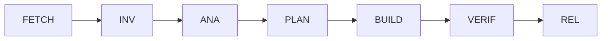
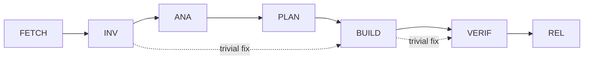

# 7-Phase Development Process

This document consolidates the development lifecycle, phase transitions, and validation.

<!--
This documentation is licensed under the MIT License.
See LICENSE-MIT for details.
-->

## Overview

The development process follows 7 mandatory phases:

1. **FETCH** - Requirements gathering, document/resource retrieval
2. **INV** - Investigation, reproduction, and requirements validation
3. **ANA** - Root cause analysis and initial architecture design
4. **PLAN** - RFC creation, detailed design, and test specification
5. **BUILD** - Implementation with API compliance and integrated documentation
6. **VERIF** - Testing, validation, and quality assurance
7. **REL** - Release preparation with complete documentation

For workspace organization, see: `.claude/docs/standards/WORKSPACE-HIERARCHY.md`

### Phase Entry Criteria

| Phase | Can Start From | Required Inputs | Skip Allowed |
|-------|----------------|-----------------|---------------|
| FETCH | New work item | Issue/requirement description | No |
| INV | FETCH or New bug | Requirements (if from FETCH) or Bug report | No |
| ANA | INV only | Validated requirements/reproduction | No |
| PLAN | ANA only | Analysis results and architecture | No |
| BUILD | PLAN only | Approved RFC and design specs | Yes (trivial) |
| VERIF | BUILD only | Implemented code and tests | No |
| REL | VERIF only | All quality gates passed | No |

### Phase Output-to-Input Mapping

| From Phase | Outputs | To Phase | Required Inputs |
|------------|---------|----------|------------------|
| FETCH | requirements.md, acceptance-criteria.md | INV | Requirements to validate |
| INV | validation-report.md, feasibility-report.md | ANA | Validated requirements |
| ANA | architecture-design.md, api-impact.md | PLAN | Architecture for detailed design |
| PLAN | detailed-design.md, test-specification.md | BUILD | Design to implement |
| BUILD | Source code, unit tests, api-compliance.md | VERIF | Code to verify |
| VERIF | test-report.md, coverage-report.md, verif-complete.yml | REL | Verification certificate |

## Task-Lifecycle Process

> **Purpose** Provide a repeatable, auditable mini-SDLC that every agent – human
> or LLM – must follow for _each_ work item (issue, PR, CI failure, etc.). It
> prevents the two classic failure modes:
>
> 1. “Shoot-from-the-hip” fixes that skip design, spec or tests and later break.
> 2. Endless analysis loops that never reach an executable patch.

The process is deliberately lightweight (all steps can fit in a single PR), yet
forces explicit _state transitions_ so that omissions are caught early.

---

## State Machine

| State                      | Required Artefacts                                                                                                                                                                    | Exit Gate                                                   |
| -------------------------- | ------------------------------------------------------------------------------------------------------------------------------------------------------------------------------------- | ----------------------------------------------------------- |
| **FETCH** (Requirements & Resources) | • requirements.md - Numbered requirements with priorities<br>• acceptance-criteria.md - Testable success conditions<br>• stakeholder-approval.md - Signed approvals<br>• resource-list.md - External resources needed<br>• .cache/* - Downloaded resources | Requirements approved by stakeholders<br>All acceptance criteria are testable<br>Resources cached locally |
| **INV** (Investigation & Validation) | • Reproduction steps / failing test<br>• Requirements validation report<br>• Feasibility assessment<br>• Logs, stack trace, screenshots | Issue reproduced and requirements validated<br>Technical feasibility confirmed |
| **ANA** (Analysis & Architecture) | • Root-cause description (1-2 para)<br>• Impacted files / modules list<br>• High-level architecture design<br>• API impact analysis | Analysis complete and architecture approved<br>API compatibility assessed |
| **PLAN** (Planning & Design) | • RFC-style note (`docs/rfcs/NNN-*.md`)<br>• Detailed design specification<br>• API compliance checklist<br>• Test specification with test cases<br>• Risk list & mitigations | Design reviewed and approved<br>Test cases defined<br>API compliance plan in place |
| **BUILD** (Implementation) | • Code implementation with unit tests<br>• API compliance verification<br>• Integrated documentation (API docs, JSDoc)<br>• Continuous quality checks<br>• build-status.yml (incremental) | TypeScript: ZERO errors (checked per file)<br>ESLint: ZERO warnings (checked per file)<br>Tests: 100% pass rate (run incrementally)<br>API compliance verified (per commit)<br>No regression from previous builds |
| **VERIF** (Verification & QA) | • test-report.md - Full test execution results<br>• coverage-report.md - Coverage ≥90% for modified files<br>• api-compliance-report.md - API compatibility verification<br>• performance-report.md - Performance benchmarks<br>• qa-checklist.md - Manual QA results<br>• CHANGELOG.md - Updated with changes<br>• verif-complete.yml - Phase completion certificate | All tests pass (100%)<br>Coverage ≥90% for modified files<br>API compliance verified<br>Performance acceptable<br>QA sign-off complete<br>CLAUDE.md checklist complete |
| **REL** (Release) | • PR created/updated • Release notes • Version bump (if applicable) | PR merged or release published |

After **REL** the task is considered _complete_ with all work merged and released.

### Same flow in Claude Code sessions

When an agent works inside the sandboxed _Claude Code_ (without opening a GitHub
PR yet), the very same artefacts **must still be committed**:

1. Use `apply_patch` to create / update `docs/rfcs/NNN-*.md`, QA sheets, and
   checklists.
2. Update the Markdown checkboxes or add a `State-Transition:` footer **in
   every turn** so that reviewers (and the `stp-guard.yml` workflow) can audit
   the progression once the branch is eventually pushed.
3. Do **not** rely on the model’s “internal memory” – everything required by a
   human reviewer must live in the repository history.

> _Example turn (CLI):_
>
> 1. Run `pnpm lint` → capture output
> 2. `apply_patch` → append log snippet to `docs/qa/0012-eslint-tsdoc-baseline.md`
> 3. `apply_patch` → mark `[x] INV` in the RFC checklist
> 4. Return explanation → next state = **ANA**

> **Skip policy** Trivial changes may skip phases as follows:
> - **Typo fixes** (< 5 lines, no runtime effect): Can go directly to BUILD → VERIF → REL
> - **Comment updates** (documentation only): Can skip to BUILD → VERIF → REL
> - **Version bumps** (no code changes): Can skip to REL
> - All skips must be documented in commit message with `[skip:<phases>]` tag

## GitHub Integration Strategy

### Issue Management

| Phase | Issue Updates | Labels |
|-------|--------------|--------|
| FETCH | Create/update issue with requirements | `phase:fetch`, `status:requirements` |
| INV | Add investigation results | `phase:inv`, `status:investigating` |
| ANA | Add analysis findings | `phase:ana`, `status:analyzing` |
| PLAN | Link to RFC PR | `phase:plan`, `status:planning` |
| BUILD | Link to implementation PR | `phase:build`, `status:implementing` |
| VERIF | Add test results | `phase:verif`, `status:testing` |
| REL | Close with release link | `phase:rel`, `status:released` |

### Pull Request Strategy

| Phase | PR Action | Branch Naming |
|-------|-----------|---------------|
| PLAN | Create draft PR with RFC | `plan/<issue-id>-<description>` |
| BUILD | Convert to ready PR | `build/<issue-id>-<description>` |
| VERIF | Request reviews | Same branch |
| REL | Merge to main | Same branch |

### Commit Strategy

Each phase has specific commit requirements:

```bash
# FETCH phase commits
git commit -m "feat(fetch): Gather requirements for <feature>

- Added requirements.md with user stories
- Added acceptance-criteria.md with test conditions
- Added stakeholder-approval.md with sign-offs

Phase: FETCH
Deliverables: requirements, acceptance criteria, approvals"

# BUILD phase commits (include API compliance)
git commit -m "feat(build): Implement <feature>

- Added <component> with <functionality>
- Added unit tests with 95% coverage
- Verified API compliance (no breaking changes)

Phase: BUILD
API-Compliance: PASS
Test-Coverage: 95%"
```

## How Agents Mark Progress

Each state transition must appear in either:

- The PR comment thread, using markdown checkboxes, e.g.
  ```
  - [x] INV bug reproduced with failing unit test
  - [x] ANA null pointer due to empty array path in `networkService`
  - [ ] PLAN
  ```
- Or the commit message footer (for auto-generated commits inside Claude Code):
  ```
  Co-Authored-By: dev-agent
  State-Transition: ANA→PLAN
  ```

CI validates STP markers by checking:

- PR body for checklists or state transitions
- **All commits** in the PR (not just the latest)
- Changed documentation files for checklist updates

See [`stp-validation-guide.md`](./stp-validation-guide.md) for detailed validation rules.

## Reviewers’ Quick Guide

1. Validate that artefacts are present & meaningful – _not_ boilerplate.
2. Confirm exit-gate criteria are met before you check the box.
3. If the change balloons in scope mid-way, revert to **ANA** and redo PLAN; do
   **not** patch ad-hoc.

## File Locations & Naming

| Artefact   | Path                    | Convention                              |
| ---------- | ----------------------- | --------------------------------------- |
| RFC / PLAN | `docs/rfcs/NNN-slug.md` | Incremental integer id; slug = kebab    |
| QA Sheet   | `docs/qa/NNN-slug.md`   | Templated headings (env, steps, result) |

The indirection keeps the root tidy and lets GitHub render diffs nicely.

---

_This document itself is MIT-licensed so you can copy-paste it into other
projects._

---

<!--
This documentation is licensed under the MIT License.
See LICENSE-MIT for details.
-->

## Claude Code Workflow & Guardrails

**Purpose** — **Complete workflow + guardrail definition** for Claude Code to autonomously execute "requirements → implementation → test → release" without runaway in multiple roles (dev / review / qa / rel ...).
_Applicable to: Claude Code CLI and Claude Code Action (GitHub integration)_

---

## 0 Scope 🗺️

- 7 phases **FETCH → INV → ANA → PLAN → BUILD → VERIF → REL**
- Each phase is decomposed into **steps → tasks** and always has **purpose / procedure / input / output / exit gate**.
- Deviations are forcibly eliminated by `.claude/validation/turn-guard.sh` + CI.

---

## 1 WBS + RACI + Exit Gate Overview

| WBS | Process              | Deliverables               | R (Responsible) | A/C/I      | Exit Gate                          |
| --- | -------------------- | -------------------------- | --------------- | ---------- | ---------------------------------- |
| 1.1 | Requirement review   | gaps.md                    | dev             | review     | gaps.md approval (review)          |
| 1.2 | Specification design | draft_workflow.md          | dev             | review     | RFC format 👍                      |
| 1.3 | Archi agreement      | final_spec.md              | review          | dev/qa/rel | All roles OK mark                  |
| 2.1 | Guard design         | guard.md                   | dev             | review     | mermaid diagram review             |
| 2.2 | Guard implementation | .claude/validation/turn-guard.sh        | dev             | qa         | shellcheck + unit green            |
| 2.3 | fetch implementation | .claude/validation/fetch-doc.sh         | dev             | qa         | Same as above                      |
| 2.4 | CI implementation    | claude.yml, label-sync.yml | dev             | qa         | GH Action green                    |
| 3.1 | Test design          | tests/spec.yml             | qa              | dev        | reviewer 👍                        |
| 3.2 | Test implementation  | guard.spec.ts              | qa              | dev        | pnpm test green                    |
| 4.1 | Document             | 02_claude-code.md          | doc             | review     | remark-lint green                  |
| 4.2 | TOC modification     | AGENTS.md etc.             | doc             | review     | link-check green                   |
| 5.1 | Integration patch    | strict_workflow.patch      | dev             | review     | git apply --check OK               |
| 5.2 | Demo PR              | run log                    | qa              | dev        | Guard FAIL / PASS example attached |
| 6.0 | Overall review       | review comments            | review          | All roles  | Resolve complete                   |
| 7.0 | Merge & tag          | Release v0.0.0-workflow    | rel             | review     | CI green + SBOM                    |

Detailed tasks are listed in §2.

---

## 2 Phase → Step → Task definition

**Legend**
**Step** shows actual command examples with “`$`”.
**Exit Gate** must list Guard ID (see §3).

### FETCH (Requirements & Resources)

| Step | Task                | Purpose                      | Procedure                                | Input           | Output                   | Exit Gate                           |
| ---- | ------------------- | ---------------------------- | ---------------------------------------- | --------------- | ------------------------ | ----------------------------------- |
| F-1  | Requirements gather | Elicit and document requirements | Interview stakeholders, analyze needs | Issue/request   | requirements.md          | Requirements documented             |
| F-2  | Acceptance criteria | Define testable criteria     | Create measurable success conditions     | requirements.md | acceptance-criteria.md   | Criteria are testable               |
| F-3  | Resource planning   | List required docs/URLs      | Identify external resources needed       | Requirements    | resource-list.md         | Resources identified                |
| F-4  | Resource retrieval  | Download external resources  | `$ .claude/validation/fetch-doc.sh URL` | resource-list   | .cache/...               | G-DUP (no duplicates)               |
| F-5  | Stakeholder approval| Get requirements sign-off    | Review with stakeholders                 | All artifacts   | stakeholder-approval.md  | Stakeholders approve                |
| F-6  | Commit artifacts    | Add all artifacts to git     | `apply_patch`                            | All outputs     | Git tree                 | All requirements artifacts committed |

### INV (Investigation & Validation)

| Step | Task                    | Purpose                      | Procedure                               | Input           | Output                    | Exit Gate                   |
| ---- | ----------------------- | ---------------------------- | --------------------------------------- | --------------- | ------------------------- | --------------------------- |
| I-1  | Requirements validation | Validate requirements feasibility | Technical assessment of requirements | requirements.md | validation-report.md      | Requirements are feasible   |
| I-2  | Issue reproduction      | Reproduce reported issue     | `$ pnpm test` or manual steps           | Bug report      | reproduction-log.md       | Issue reproduced            |
| I-3  | Create failing test     | Document issue as test       | `apply_patch` to create test file       | Repro steps     | test.spec.ts              | Test fails as expected      |
| I-4  | Impact assessment       | Analyze affected components  | Code analysis and dependency check      | Issue details   | impact-analysis.md        | Impact scope defined        |
| I-5  | Feasibility check       | Confirm technical approach   | Prototype or proof of concept           | Requirements    | feasibility-report.md     | Approach validated          |

### Complete Task Definitions

All tasks are defined in detail for each phase:

- FETCH: 6 tasks (F-1 to F-6) - Requirements engineering and resource gathering
- INV: 5 tasks (I-1 to I-5) - Investigation and validation
- ANA: 5 tasks - Analysis and architecture design
- PLAN: 6 tasks - Planning, detailed design, and test specification
- BUILD: 8 tasks - Implementation with API compliance
- VERIF: 7 tasks - Comprehensive verification including refactoring
- REL: 4 tasks - Release with complete documentation

**Task Summary:**

| Phase     | Tasks                                                                                | Key Deliverables                             |
| --------- | ------------------------------------------------------------------------------------ | -------------------------------------------- |
| **FETCH** | Requirements gathering, acceptance criteria, resource retrieval, stakeholder approval | requirements.md, acceptance-criteria.md, approval-record.md |
| **INV**   | Requirements validation, issue reproduction, impact assessment, feasibility check     | validation-report.md, reproduction-log.md, feasibility-report.md |
| **ANA**   | Root cause analysis, architecture design, API impact analysis, risk assessment        | cause-tree.md, architecture-design.md, api-impact.md, risks.md |
| **PLAN**  | RFC draft, detailed design, API specification, test specification, review checkpoint  | rfc-draft.md, detailed-design.md, api-spec.md, test-spec.md |
| **BUILD** | Implementation, unit tests, API compliance verification, documentation, integration   | src/ code, tests/, api-compliance-report.md, integrated docs |
| **VERIF** | Full testing, coverage check, API compliance validation, performance, refactoring     | test-report.md, coverage.html, performance-report.md, refactoring-log.md |
| **REL**   | Documentation finalization, version bump, release notes, deployment                   | Complete docs, package.json, RELEASE.md, Git tag, deployment-report.md |

---

## 3 Guard Map

Guards are automated checks that enforce workflow rules and quality standards. The table below shows key examples:

| Guard ID | Verification content        | Corresponding task |
| -------- | --------------------------- | ------------------ |
| G-PHASE  | Tag order, think token      | All                |
| G-NET    | Non-FETCH URL?              | All tasks          |
| G-SIZE   | LOC ≤1 000, files ≤10       | B-1                |
| G-EDGE   | New test Green              | B-2                |
| G-COV    | Changed line coverage ≥90 % | V-1                |

**For the complete guard map with all 25+ guards, see: [`02_claude-code-guard-map.md`](./02_claude-code-guard-map.md)**

The guards are categorized as:

- **Structure Guards** (G-PHASE, G-TOKEN, G-LABEL, etc.) - Enforce workflow structure
- **Quality Guards** (G-RFC, G-TEST, G-LINT, etc.) - Ensure code quality
- **Process Guards** (G-USER-OK, G-WBS-OK, etc.) - Validate approvals
- **Access Control Guards** (G-ROLE, G-STATE, etc.) - Enforce permissions

---

## 4 Task template

```md
## BUILD / B-1 Code modification

Purpose: Change implementation according to patch-plan.md with minimum LOC
Input: patch-plan.md
Procedure: 1) apply_patch → 2) $ pnpm lint → 3) $ pnpm test
Output : src diff
Exit : LOC ≤ 1 000, files ≤ 10, G-SIZE ○, test green
```

---

## 5 Phase Diagram



**For complete phase transition validation and dependency enforcement, see: [`phase-transition-validation.md`](./phase-transition-validation.md)**

Key improvements:

- Explicit phase dependencies with completion artifacts
- Enhanced security validation for FETCH phase
- Flexible BUILD constraints with exception handling
- REL phase requires VERIF completion certificate

---

## 6 RACI list

Save the same content in `final_spec.md` as CSV.

---

<\!--
This documentation is licensed under the MIT License.
See LICENSE-MIT for details.
-->

## Phase Transition Validation and Constraint Enforcement

This document defines the explicit phase dependencies, transition logic, and constraint validation for the Claude Code workflow.

## Phase Dependency Graph



## Phase Definitions with Explicit Dependencies

### FETCH Phase (Requirements & Resources)

```yaml
phase: FETCH
purpose: Gather requirements and retrieve external resources
allowed_operations:
  - stakeholder_interviews
  - requirements_documentation
  - network_access
  - file_download
  - cache_write
depends_on: [] # Entry point - no dependencies
required_artifacts:
  - requirements.md
  - acceptance-criteria.md
  - stakeholder-approval.md
  - resource-list.md
  - .cache/* (downloaded files)
constraints:
  - Requirements must be testable
  - Stakeholder approval required
  - URL validation required
  - SHA256 duplicate check (G-DUP)
  - Max download size: 10MB
validation:
  - Requirements completeness check
  - Acceptance criteria testability
  - .claude/validation/fetch-doc.sh --validate-url
  - .claude/validation/turn-guard.sh (G-DUP check)
downstream_impact:
  - Changes invalidate all subsequent phases
  - Requires re-approval from stakeholders
  - Must notify all active work items
```

### INV Phase

```yaml
phase: INV
purpose: Investigate and reproduce issues
allowed_operations:
  - run_tests
  - create_failing_test
  - document_reproduction
depends_on:
  - FETCH # If external docs needed
  - null # Can be entry point
required_artifacts:
  - fail-log.md
  - test.spec.ts (failing test)
  - docs/qa/investigation.md
constraints:
  - No fixes allowed
  - Must include "Assumed Goals" section
  - Reproduction must be verifiable
validation:
  - Test must fail (exit != 0)
  - G-TRIAGE guard check
```

### ANA Phase

```yaml
phase: ANA
purpose: Root cause analysis and impact assessment
allowed_operations:
  - code_analysis
  - impact_assessment
  - risk_evaluation
depends_on:
  - INV # Must have investigation complete
required_artifacts:
  - cause-tree.md (mermaid diagram)
  - impact.md (affected modules)
  - risks.md (FMEA table)
constraints:
  - No implementation allowed
  - All risks must have mitigations
  - Impact scope must be complete
validation:
  - G-RISK guard (all risks mitigated)
  - Reviewer approval required
```

### PLAN Phase

```yaml
phase: PLAN
purpose: Design solution and get approval
allowed_operations:
  - rfc_creation
  - test_strategy_design
  - scope_definition
depends_on:
  - ANA # Must have analysis complete
required_artifacts:
  - docs/rfcs/NNN-*.md
  - test-plan.md
  - patch-plan.md
constraints:
  - RFC format required
  - LOC estimate ≤ 1000
  - Test coverage plan ≥ 90%
  - Reviewer approval required
validation:
  - G-RFC guard (format check)
  - G-WBS-OK (all items approved)
  - 1+ reviewer thumbs up
```

### BUILD Phase

```yaml
phase: BUILD
purpose: Implement solution
allowed_operations:
  - code_modification
  - test_creation
  - documentation_update
depends_on:
  - PLAN # Must have approved plan
required_artifacts:
  - src/* patches
  - test/* patches
  - docs/* updates
constraints:
  - Maximum 1000 lines of code (G-SIZE)
  - Maximum 10 files per patch (G-SIZE)
  - All tests must pass
  - Lint/type checks must pass
validation:
  - G-SIZE guard enforcement
  - G-TEST, G-LINT, G-TYPE guards
  - CI pipeline green
```

### VERIF Phase

```yaml
phase: VERIF
purpose: Verify implementation quality
allowed_operations:
  - coverage_check
  - performance_test
  - security_scan
  - manual_qa
depends_on:
  - BUILD # Must have implementation complete
  - BUILD.artifacts.tests_pass == true
required_artifacts:
  - coverage.html (≥90%)
  - qa-results.md
  - perf-report.md
  - CHANGELOG.md update
constraints:
  - No new features
  - No breaking changes
  - All quality gates must pass
validation:
  - G-COV (coverage ≥ 90%)
  - G-PERF (no regression)
  - G-SEC (no vulnerabilities)
  - QA sign-off required
```

### REL Phase

```yaml
phase: REL
purpose: Create release
allowed_operations:
  - version_bump
  - create_release
  - tag_creation
depends_on:
  - VERIF # Must have verification complete
  - VERIF.artifacts.qa_signoff == true
  - VERIF.validation.all_passed == true
required_artifacts:
  - Version update (package.json)
  - Release notes (RELEASE.md)
  - Git tag
  - VERIF completion certificate
constraints:
  - Only after VERIF complete
  - Must have VERIF phase completion artifact
  - Semantic versioning required
  - No direct code changes
validation:
  - G-SEMVER (version format)
  - VERIF completion check
  - Release checklist complete
```

## Transition Enforcement Mechanism

### 1. Phase Completion Artifacts

Each phase must update its status file before transition:

```bash
# Example phase status update
cat > .claude/workspace/projects/issue-13-cors-proxy/VERIF/.phase-status.yml << EOF
phase: "VERIF"
entered: "2024-01-15T09:00:00Z"
completed: "2024-01-15T10:30:00Z"
status: "completed"

tasks:
  V-1-coverage:
    status: "completed"
    coverage: "92.5%"
  V-2-qa:
    status: "completed"
    qa_signoff: true
  V-3-performance:
    status: "completed"
    perf_regression: false

exit_criteria:
  coverage_met: true
  qa_signoff: true
  no_regressions: true

artifacts:
  - "coverage.html"
  - "qa-results.md"
  - "performance-report.md"
EOF
```

### 2. Transition Validation Function

Add to `.claude/validation/turn-guard.sh`:

```bash
# Helper function to check phase status
check_phase_status() {
  local status_file="$1"
  local expected_status="$2"
  
  if [[ ! -f "$status_file" ]]; then
    return 1
  fi
  
  grep -q "status: \"$expected_status\"" "$status_file"
}

# Phase transition validation
validate_phase_transition() {
  local current_phase="$1"
  local next_phase="$2"
  local project_dir="$3"  # Add project directory parameter

  # Check if previous phase completed
  case "$next_phase" in
    INV)
      # Can start from FETCH or be entry point
      [[ "$current_phase" == "FETCH" || -z "$current_phase" ]] || \
        die "INV requires FETCH completion or new task"
      ;;
    ANA)
      # Check if INV phase is completed
      check_phase_status "$project_dir/INV/.phase-status.yml" "completed" || \
        die "ANA requires INV phase completion"
      ;;
    PLAN)
      # Check if ANA phase is completed
      check_phase_status "$project_dir/ANA/.phase-status.yml" "completed" || \
        die "PLAN requires ANA phase completion"
      ;;
    BUILD)
      # Check if PLAN phase is completed
      check_phase_status "$project_dir/PLAN/.phase-status.yml" "completed" || \
        die "BUILD requires PLAN phase completion"
      # Check for approved RFC
      [[ -f "$project_dir/PLAN/.phase-status.yml" ]] && \
        grep -q "rfc_approved: true" "$project_dir/PLAN/.phase-status.yml" || \
        die "BUILD requires approved RFC"
      ;;
    VERIF)
      # Check if BUILD phase is completed
      check_phase_status "$project_dir/BUILD/.phase-status.yml" "completed" || \
        die "VERIF requires BUILD phase completion"
      ;;
    REL)
      # Check if VERIF phase is completed
      check_phase_status "$project_dir/VERIF/.phase-status.yml" "completed" || \
        die "REL requires VERIF phase completion"
      # Check QA signoff
      grep -q "qa_signoff: true" "$project_dir/VERIF/.phase-status.yml" || \
        die "REL requires QA sign-off from VERIF"
      ;;
  esac
}
```

### 3. Enhanced fetch_doc.sh Validation

```bash
#!/usr/bin/env bash
# Enhanced fetch_doc.sh with security validation

validate_url() {
  local url="$1"

  # Blocklist check
  if grep -qE "(malicious|phishing|spam)" <<< "$url"; then
    die "URL blocked: suspicious domain"
  fi

  # Protocol check
  if ! grep -qE "^https?://" <<< "$url"; then
    die "Only HTTP(S) protocols allowed"
  fi

  # Size check (HEAD request)
  size=$(curl -sI "$url" | grep -i content-length | awk '{print $2}' | tr -d '\r')
  if [[ -n "$size" && "$size" -gt 10485760 ]]; then # 10MB
    die "File too large: $size bytes (max 10MB)"
  fi

  # Content-Type check
  content_type=$(curl -sI "$url" | grep -i content-type)
  if grep -qiE "(executable|binary|application/x-)" <<< "$content_type"; then
    die "Blocked content type: $content_type"
  fi
}

# Main fetch logic
fetch_doc() {
  local url="$1"
  validate_url "$url"

  # Download with timeout and size limit
  curl -L --max-time 30 --max-filesize 10M \
    --user-agent "Claude-Code-Fetcher/1.0" \
    -o ".cache/$(basename "$url")" \
    "$url"
}
```

### 4. Constraint Adjustment Recommendations

#### BUILD Phase Constraints

Current constraints may be too restrictive. Recommend:

```yaml
constraints:
  standard:
    - Maximum 1000 lines of code
    - Maximum 10 files per patch
  exceptions:
    - Refactoring: up to 2000 LOC if tests unchanged
    - Generated code: up to 5000 LOC if marked
    - Migration: up to 20 files if atomic change
  approval:
    - Exceptions require explicit reviewer approval
    - Must document reason in RFC
```

### 5. CI Integration for Phase Validation

```yaml
# .github/workflows/phase-validation.yml
name: Phase Transition Validation

on:
  pull_request:
    types: [labeled, unlabeled]

jobs:
  validate-transition:
    runs-on: ubuntu-latest
    steps:
      - uses: actions/checkout@v4

      - name: Extract phase from label
        id: phase
        run: |
          PHASE=$(echo "${{ github.event.label.name }}" | grep -oE "(FETCH|INV|ANA|PLAN|BUILD|VERIF|REL)")
          echo "phase=$PHASE" >> $GITHUB_OUTPUT

      - name: Check phase dependencies
        run: |
          # Check for required artifacts
          case "${{ steps.phase.outputs.phase }}" in
            REL)
              # Verify VERIF completion
              if ! test -f .phase/VERIF-complete.json; then
                echo "::error::REL phase requires VERIF completion artifact"
                exit 1
              fi
              ;;
          esac

      - name: Run phase-specific validation
        run: |
          ./.claude/validation/turn-guard.sh validate-phase-transition \
            "${{ steps.phase.outputs.previous }}" \
            "${{ steps.phase.outputs.phase }}"
```

## Early Quality Gates (Regression Prevention)

### Incremental Validation in BUILD Phase

To prevent late-stage failures, implement continuous validation:

```bash
# Pre-commit hook (.git/hooks/pre-commit)
#!/bin/bash
# Run for every commit in BUILD phase

# 1. Type check only changed files
CHANGED_TS=$(git diff --cached --name-only --diff-filter=ACM | grep '\.ts$')
if [ ! -z "$CHANGED_TS" ]; then
  pnpm tsc --noEmit $CHANGED_TS || exit 1
fi

# 2. Lint only changed files
CHANGED_FILES=$(git diff --cached --name-only --diff-filter=ACM)
if [ ! -z "$CHANGED_FILES" ]; then
  pnpm eslint $CHANGED_FILES || exit 1
fi

# 3. Run affected tests
pnpm test:affected || exit 1

# 4. Check API compliance
pnpm api:check || exit 1
```

### Continuous Integration Checks

Each commit triggers validation:

| Check | When | Failure Action |
|-------|------|----------------|
| TypeScript | Every file save | Block commit |
| ESLint | Every file save | Block commit |
| Unit tests | Every commit | Block push |
| API compliance | Every commit | Create warning |
| Integration tests | Every push | Block PR merge |

## Refactoring Activities

Refactoring is integrated into the VERIF phase to ensure code quality improvements:

### When to Refactor
- After all tests pass in VERIF phase
- When code complexity exceeds thresholds
- When performance benchmarks are not met
- Before finalizing documentation

### Refactoring Checklist
```markdown
- [ ] Reduce cyclomatic complexity below 10
- [ ] Eliminate code duplication (DRY principle)
- [ ] Improve naming clarity
- [ ] Extract long methods (max 20 lines)
- [ ] Update tests to match refactored code
- [ ] Verify no regression in functionality
- [ ] Document refactoring decisions in refactoring-log.md
```

## Documentation Update Timeline

Documentation must be updated at specific points in each phase:

| Phase | Documentation Requirements | When to Update |
|-------|---------------------------|----------------|
| **FETCH** | Requirements, acceptance criteria | As requirements are gathered |
| **INV** | Investigation findings, validation results | During investigation |
| **ANA** | Architecture diagrams, API impact | After analysis complete |
| **PLAN** | RFC, detailed design, API specs, test specs | During planning |
| **BUILD** | API docs (JSDoc), inline comments | While coding |
| **VERIF** | Test results, coverage reports, CHANGELOG | After tests pass |
| **REL** | README updates, migration guides, release notes | Before release |

### Documentation Quality Gates
- No phase completes without required documentation
- All public APIs must have JSDoc comments
- CHANGELOG.md must be updated for any user-facing changes
- README.md must reflect new features or breaking changes

## API Compliance Verification

API compliance is verified at multiple points:

### Design Phase (PLAN)
- Define API contracts in api-spec.md
- Review for backward compatibility
- Document breaking changes

### Implementation Phase (BUILD)
- Implement according to API specification
- Run API compliance checks:
  ```bash
  pnpm run api:check  # Verify API signatures
  pnpm run api:diff   # Check for breaking changes
  ```

### Verification Phase (VERIF)
- Validate API compliance report
- Test backward compatibility
- Update API documentation

### API Compliance Checklist
```markdown
- [ ] All public APIs documented
- [ ] No unintended breaking changes
- [ ] Deprecation warnings for changes
- [ ] Migration guide for breaking changes
- [ ] API versioning updated if needed
```

## Change Management Process

### Upstream Change Handling

When changes occur in earlier phases, follow this process:

| Change in Phase | Impact | Required Actions |
|-----------------|--------|------------------|
| FETCH (Requirements) | Invalidates all work | 1. Stop current work<br>2. Create change request<br>3. Get stakeholder approval<br>4. Reset to FETCH |
| INV (Validation) | May invalidate ANA-REL | 1. Review impact on analysis<br>2. Update feasibility report<br>3. Continue or reset to INV |
| ANA (Architecture) | Invalidates PLAN-REL | 1. Review design compatibility<br>2. Update architecture docs<br>3. Reset to PLAN |
| PLAN (Design) | Invalidates BUILD-REL | 1. Assess implementation impact<br>2. Update design docs<br>3. Reset to BUILD |

### Change Request Template

```markdown
## Change Request CR-XXX

**Current Phase**: [PHASE]
**Change Type**: [Requirements/Design/Architecture/Implementation]
**Impact Level**: [High/Medium/Low]

### Description
[What is changing and why]

### Impact Analysis
- Affected phases: [List phases]
- Affected deliverables: [List documents]
- Effort impact: [Hours/Days]

### Approval
- [ ] Stakeholder approval (if requirements change)
- [ ] Technical lead approval
- [ ] PM approval
```

### API Breaking Change Process

If API changes are required:

1. **Detection** (BUILD/VERIF phase):
   ```bash
   pnpm run api:check  # Detects breaking changes
   ```

2. **Decision Point**:
   - If minor: Add deprecation warnings, continue
   - If major: Stop, create change request, go back to PLAN

3. **Migration Path**:
   - Create migration-guide.md
   - Update api-spec.md with new version
   - Add deprecation timeline

## Phase Completion Certificates

Each phase must generate a completion certificate before transition:

```yaml
# .phase-status.yml format
phase: "BUILD"
status: "completed"
timestamp: "2024-01-15T10:30:00Z"
deliverables:
  - path: "src/feature.ts"
    checksum: "sha256:abc123..."
  - path: "tests/feature.spec.ts"
    checksum: "sha256:def456..."
validation:
  typescript: "PASS"
  eslint: "PASS"
  tests: "PASS (100%)"
  coverage: "95%"
  api_compliance: "PASS"
next_phase: "VERIF"
approver: "@username"
```

## Summary of Integrated Process

This integrated development process includes:

1. **Requirements Engineering**: Formal requirements gathering in FETCH phase
2. **Requirements Validation**: Technical feasibility in INV phase
3. **Architecture Design**: High-level design in ANA phase
4. **Detailed Design & Test Specs**: Comprehensive specifications in PLAN phase
5. **API Compliance**: Verification throughout BUILD and VERIF phases
6. **Refactoring**: Code quality improvements in VERIF phase
7. **Documentation Timeline**: Clear update points for all documentation
8. **Quality Gates**: Mandatory checks at each phase transition
9. **Change Management**: Process for handling upstream changes
10. **Phase Certificates**: Formal completion verification

All improvements maintain backward compatibility with the existing 7-phase model while addressing identified gaps in the development lifecycle.

## Process Validation Cross-References

### Deliverable Consistency Check
| Deliverable | Created In | Used By | Format |
|-------------|------------|---------|--------|
| requirements.md | FETCH (F-1) | INV (I-1) | Markdown with numbered items |
| acceptance-criteria.md | FETCH (F-2) | INV, VERIF | Markdown with test conditions |
| stakeholder-approval.md | FETCH (F-5) | All phases | Markdown with signatures |
| validation-report.md | INV (I-1) | ANA | Markdown with feasibility |
| architecture-design.md | ANA | PLAN | Markdown with diagrams |
| api-impact.md | ANA | PLAN, BUILD | Markdown with breaking changes |
| detailed-design.md | PLAN | BUILD | Markdown with specifications |
| test-specification.md | PLAN | BUILD, VERIF | Markdown with test cases |
| api-compliance-report.md | BUILD, VERIF | REL | Markdown with results |
| verif-complete.yml | VERIF | REL | YAML with validation results |
| .phase-status.yml | All phases | CI/CD | YAML with phase metadata |

### Process Integrity Verification
- ✓ All phase outputs map to next phase inputs
- ✓ Skip policy is consistent with phase dependencies
- ✓ GitHub integration covers all phases
- ✓ Change management handles all upstream impacts
- ✓ Quality gates prevent regression at multiple points
- ✓ Documentation timeline covers all phases
- ✓ API compliance is verified continuously
- ✓ Phase completion is formally certified
