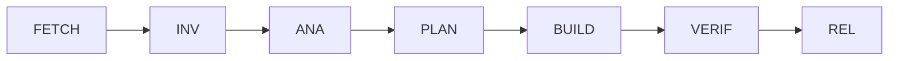
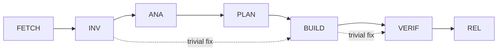

# 7-Phase Development Process

This document consolidates the development lifecycle, phase transitions, and validation.

<!--
This documentation is licensed under the MIT License.
See LICENSE-MIT for details.
-->

## Overview

The development process follows 7 mandatory phases:

1. **FETCH** - Document/resource retrieval
2. **INV** - Investigation and reproduction
3. **ANA** - Root cause analysis
4. **PLAN** - RFC creation and planning
5. **BUILD** - Implementation
6. **VERIF** - Testing and validation
7. **REL** - Release preparation

For workspace organization, see: `.claude/docs/standards/WORKSPACE-HIERARCHY.md`

## Task-Lifecycle Process

> **Purpose** Provide a repeatable, auditable mini-SDLC that every agent – human
> or LLM – must follow for _each_ work item (issue, PR, CI failure, etc.). It
> prevents the two classic failure modes:
>
> 1. “Shoot-from-the-hip” fixes that skip design, spec or tests and later break.
> 2. Endless analysis loops that never reach an executable patch.

The process is deliberately lightweight (all steps can fit in a single PR), yet
forces explicit _state transitions_ so that omissions are caught early.

---

## State Machine

| State                      | Required Artefacts                                                                                                                                                                    | Exit Gate                                                   |
| -------------------------- | ------------------------------------------------------------------------------------------------------------------------------------------------------------------------------------- | ----------------------------------------------------------- |
| **FETCH** (Resource Gathering) | • Downloaded docs, specs, references • Cached resources in workspace • Summary of gathered materials | All necessary resources available locally |
| **INV** (Investigation) | • Reproduction steps / failing test • Logs, stack trace, screenshots | Maintainer (or reporter) acknowledges reproduction is valid |
| **ANA** (Analysis) | • Root-cause description (1-2 para) • Impacted files / modules list | Reviewer agrees the analysis matches evidence |
| **PLAN** | • RFC-style note (`docs/rfcs/NNN-*.md`) containing: – Scope & out-of-scope – Risk list & mitigations – Test strategy (unit / int / e2e) – Estimated effort & timeline | 1 reviewer 👍 or design-meeting approval |
| **BUILD** | • Code, docs, migration scripts, test fixtures | CI ‑ lint + type-check + tests green |
| **VERIF** | • Test results attached • Manual QA notes (if UI) • CHANGELOG entry | Reviewer & QA sign-off |
| **REL** (Release) | • PR created/updated • Release notes • Version bump (if applicable) | PR merged or release published |

After **REL** the task is considered _complete_ with all work merged and released.

### Same flow in Claude Code sessions

When an agent works inside the sandboxed _Claude Code_ (without opening a GitHub
PR yet), the very same artefacts **must still be committed**:

1. Use `apply_patch` to create / update `docs/rfcs/NNN-*.md`, QA sheets, and
   checklists.
2. Update the Markdown checkboxes or add a `State-Transition:` footer **in
   every turn** so that reviewers (and the `stp-guard.yml` workflow) can audit
   the progression once the branch is eventually pushed.
3. Do **not** rely on the model’s “internal memory” – everything required by a
   human reviewer must live in the repository history.

> _Example turn (CLI):_
>
> 1. Run `pnpm lint` → capture output
> 2. `apply_patch` → append log snippet to `docs/qa/0012-eslint-tsdoc-baseline.md`
> 3. `apply_patch` → mark `[x] INV` in the RFC checklist
> 4. Return explanation → next state = **ANA**

> **Skip policy** Trivial chores (typo fixes, comment clarifications, version
> bumps) may collapse states _INV → BUILD → VERIF_ **only if** the change is
> < 5 lines and has no runtime effect.

## How Agents Mark Progress

Each state transition must appear in either:

- The PR comment thread, using markdown checkboxes, e.g.
  ```
  - [x] INV bug reproduced with failing unit test
  - [x] ANA null pointer due to empty array path in `networkService`
  - [ ] PLAN
  ```
- Or the commit message footer (for auto-generated commits inside Claude Code):
  ```
  Co-Authored-By: dev-agent
  State-Transition: ANA→PLAN
  ```

CI validates STP markers by checking:

- PR body for checklists or state transitions
- **All commits** in the PR (not just the latest)
- Changed documentation files for checklist updates

See [`stp-validation-guide.md`](./stp-validation-guide.md) for detailed validation rules.

## Reviewers’ Quick Guide

1. Validate that artefacts are present & meaningful – _not_ boilerplate.
2. Confirm exit-gate criteria are met before you check the box.
3. If the change balloons in scope mid-way, revert to **ANA** and redo PLAN; do
   **not** patch ad-hoc.

## File Locations & Naming

| Artefact   | Path                    | Convention                              |
| ---------- | ----------------------- | --------------------------------------- |
| RFC / PLAN | `docs/rfcs/NNN-slug.md` | Incremental integer id; slug = kebab    |
| QA Sheet   | `docs/qa/NNN-slug.md`   | Templated headings (env, steps, result) |

The indirection keeps the root tidy and lets GitHub render diffs nicely.

---

_This document itself is MIT-licensed so you can copy-paste it into other
projects._

---

<!--
This documentation is licensed under the MIT License.
See LICENSE-MIT for details.
-->

## Claude Code Workflow & Guardrails

**Purpose** — **Complete workflow + guardrail definition** for Claude Code to autonomously execute "requirements → implementation → test → release" without runaway in multiple roles (dev / review / qa / rel ...).
_Applicable to: Claude Code CLI and Claude Code Action (GitHub integration)_

---

## 0 Scope 🗺️

- 7 phases **FETCH → INV → ANA → PLAN → BUILD → VERIF → REL**
- Each phase is decomposed into **steps → tasks** and always has **purpose / procedure / input / output / exit gate**.
- Deviations are forcibly eliminated by `tools/turn_guard.sh` + CI.

---

## 1 WBS + RACI + Exit Gate Overview

| WBS | Process              | Deliverables               | R (Responsible) | A/C/I      | Exit Gate                          |
| --- | -------------------- | -------------------------- | --------------- | ---------- | ---------------------------------- |
| 1.1 | Requirement review   | gaps.md                    | dev             | review     | gaps.md approval (review)          |
| 1.2 | Specification design | draft_workflow.md          | dev             | review     | RFC format 👍                      |
| 1.3 | Archi agreement      | final_spec.md              | review          | dev/qa/rel | All roles OK mark                  |
| 2.1 | Guard design         | guard.md                   | dev             | review     | mermaid diagram review             |
| 2.2 | Guard implementation | tools/turn_guard.sh        | dev             | qa         | shellcheck + unit green            |
| 2.3 | fetch implementation | tools/fetch_doc.sh         | dev             | qa         | Same as above                      |
| 2.4 | CI implementation    | claude.yml, label-sync.yml | dev             | qa         | GH Action green                    |
| 3.1 | Test design          | tests/spec.yml             | qa              | dev        | reviewer 👍                        |
| 3.2 | Test implementation  | guard.spec.ts              | qa              | dev        | pnpm test green                    |
| 4.1 | Document             | 02_claude-code.md          | doc             | review     | remark-lint green                  |
| 4.2 | TOC modification     | AGENTS.md etc.             | doc             | review     | link-check green                   |
| 5.1 | Integration patch    | strict_workflow.patch      | dev             | review     | git apply --check OK               |
| 5.2 | Demo PR              | run log                    | qa              | dev        | Guard FAIL / PASS example attached |
| 6.0 | Overall review       | review comments            | review          | All roles  | Resolve complete                   |
| 7.0 | Merge & tag          | Release v0.0.0-workflow    | rel             | review     | CI green + SBOM                    |

Detailed tasks are listed in §2.

---

## 2 Phase → Step → Task definition

**Legend**
**Step** shows actual command examples with “`$`”.
**Exit Gate** must list Guard ID (see §3).

### FETCH

| Step | Task                | Purpose             | Procedure                   | Input           | Output      | Exit Gate                    |
| ---- | ------------------- | ------------------- | --------------------------- | --------------- | ----------- | ---------------------------- |
| F-1  | Retrieval plan      | List required URLs  | Markdown table in `<think>` | Assignment text | doc-list.md | ―                            |
| F-2  | Retrieval execution | File DL & cache     | `$ tools/fetch_doc.sh URL`  | doc-list.md     | .cache/...  | G-DUP                        |
| F-3  | Commit              | Add retrieved items | `apply_patch`               | .cache          | Git tree    | diff is retrieved items only |

### INV

| Step | Task         | Purpose           | Procedure     | Output   | Exit Gate |
| ---- | ------------ | ----------------- | ------------- | -------- | --------- |
| I-1  | Reproduce    | Reproduce failure | `$ pnpm test` | fail-log | exit≠0    |
| I-2  | Minimal test | Create Red test   | `apply_patch` | spec     | spec Red  |

### Complete Task Definitions

The remaining tasks follow the same tabular format. All 28 tasks are defined across the 7 phases:

- FETCH: 3 tasks (F-1 to F-3)
- INV: 3 tasks (I-1 to I-3)
- ANA: 4 tasks (A-1 to A-4)
- PLAN: 4 tasks (P-1 to P-4)
- BUILD: 6 tasks (B-1 to B-6)
- VERIF: 5 tasks (V-1 to V-5)
- REL: 3 tasks (R-1 to R-3)

**For the complete task definitions, see: [`02_claude-code-complete-tasks.md`](./02_claude-code-complete-tasks.md)**

**Task Summary:**

| Phase     | Tasks                                                                                | Key Deliverables                             |
| --------- | ------------------------------------------------------------------------------------ | -------------------------------------------- |
| **ANA**   | Causal tree, Impact scope, Risk assessment, Commit analysis                          | cause-tree.md, impact.md, risks.md           |
| **PLAN**  | RFC draft, Test strategy, Patch design, Review checkpoint                            | rfc-draft.md, test-plan.md, patch-plan.md    |
| **BUILD** | Code modification, Unit tests, Lint & format, Type check, Integration, Documentation | src/ diff, test/ diff, docs/ diff            |
| **VERIF** | Coverage check, Manual QA, Performance, Security scan, Changelog                     | coverage.html, qa-results.md, CHANGELOG diff |
| **REL**   | Version bump, Release notes, Tag & publish                                           | package.json, RELEASE.md, Git tag            |

---

## 3 Guard Map

Guards are automated checks that enforce workflow rules and quality standards. The table below shows key examples:

| Guard ID | Verification content        | Corresponding task |
| -------- | --------------------------- | ------------------ |
| G-PHASE  | Tag order, think token      | All                |
| G-NET    | Non-FETCH URL?              | All tasks          |
| G-SIZE   | LOC ≤1 000, files ≤10       | B-1                |
| G-EDGE   | New test Green              | B-2                |
| G-COV    | Changed line coverage ≥90 % | V-1                |

**For the complete guard map with all 25+ guards, see: [`02_claude-code-guard-map.md`](./02_claude-code-guard-map.md)**

The guards are categorized as:

- **Structure Guards** (G-PHASE, G-TOKEN, G-LABEL, etc.) - Enforce workflow structure
- **Quality Guards** (G-RFC, G-TEST, G-LINT, etc.) - Ensure code quality
- **Process Guards** (G-USER-OK, G-WBS-OK, etc.) - Validate approvals
- **Access Control Guards** (G-ROLE, G-STATE, etc.) - Enforce permissions

---

## 4 Task template

```md
## BUILD / B-1 Code modification

Purpose: Change implementation according to patch-plan.md with minimum LOC
Input: patch-plan.md
Procedure: 1) apply_patch → 2) $ pnpm lint → 3) $ pnpm test
Output : src diff
Exit : LOC ≤ 1 000, files ≤ 10, G-SIZE ○, test green
```

---

## 5 Phase Diagram



**For complete phase transition validation and dependency enforcement, see: [`phase-transition-validation.md`](./phase-transition-validation.md)**

Key improvements:

- Explicit phase dependencies with completion artifacts
- Enhanced security validation for FETCH phase
- Flexible BUILD constraints with exception handling
- REL phase requires VERIF completion certificate

---

## 6 RACI list

Save the same content in `final_spec.md` as CSV.

---

<\!--
This documentation is licensed under the MIT License.
See LICENSE-MIT for details.
-->

## Phase Transition Validation and Constraint Enforcement

This document defines the explicit phase dependencies, transition logic, and constraint validation for the Claude Code workflow.

## Phase Dependency Graph



## Phase Definitions with Explicit Dependencies

### FETCH Phase

```yaml
phase: FETCH
purpose: Retrieve external documents and resources
allowed_operations:
  - network_access
  - file_download
  - cache_write
depends_on: [] # Entry point - no dependencies
required_artifacts:
  - doc-list.md
  - .cache/* (downloaded files)
constraints:
  - URL validation required
  - SHA256 duplicate check (G-DUP)
  - Malicious URL blocking
  - Max download size: 10MB
validation:
  - tools/fetch_doc.sh --validate-url
  - tools/turn_guard.sh (G-DUP check)
```

### INV Phase

```yaml
phase: INV
purpose: Investigate and reproduce issues
allowed_operations:
  - run_tests
  - create_failing_test
  - document_reproduction
depends_on:
  - FETCH # If external docs needed
  - null # Can be entry point
required_artifacts:
  - fail-log.md
  - test.spec.ts (failing test)
  - docs/qa/investigation.md
constraints:
  - No fixes allowed
  - Must include "Assumed Goals" section
  - Reproduction must be verifiable
validation:
  - Test must fail (exit != 0)
  - G-TRIAGE guard check
```

### ANA Phase

```yaml
phase: ANA
purpose: Root cause analysis and impact assessment
allowed_operations:
  - code_analysis
  - impact_assessment
  - risk_evaluation
depends_on:
  - INV # Must have investigation complete
required_artifacts:
  - cause-tree.md (mermaid diagram)
  - impact.md (affected modules)
  - risks.md (FMEA table)
constraints:
  - No implementation allowed
  - All risks must have mitigations
  - Impact scope must be complete
validation:
  - G-RISK guard (all risks mitigated)
  - Reviewer approval required
```

### PLAN Phase

```yaml
phase: PLAN
purpose: Design solution and get approval
allowed_operations:
  - rfc_creation
  - test_strategy_design
  - scope_definition
depends_on:
  - ANA # Must have analysis complete
required_artifacts:
  - docs/rfcs/NNN-*.md
  - test-plan.md
  - patch-plan.md
constraints:
  - RFC format required
  - LOC estimate ≤ 1000
  - Test coverage plan ≥ 90%
  - Reviewer approval required
validation:
  - G-RFC guard (format check)
  - G-WBS-OK (all items approved)
  - 1+ reviewer thumbs up
```

### BUILD Phase

```yaml
phase: BUILD
purpose: Implement solution
allowed_operations:
  - code_modification
  - test_creation
  - documentation_update
depends_on:
  - PLAN # Must have approved plan
required_artifacts:
  - src/* patches
  - test/* patches
  - docs/* updates
constraints:
  - Maximum 1000 lines of code (G-SIZE)
  - Maximum 10 files per patch (G-SIZE)
  - All tests must pass
  - Lint/type checks must pass
validation:
  - G-SIZE guard enforcement
  - G-TEST, G-LINT, G-TYPE guards
  - CI pipeline green
```

### VERIF Phase

```yaml
phase: VERIF
purpose: Verify implementation quality
allowed_operations:
  - coverage_check
  - performance_test
  - security_scan
  - manual_qa
depends_on:
  - BUILD # Must have implementation complete
  - BUILD.artifacts.tests_pass == true
required_artifacts:
  - coverage.html (≥90%)
  - qa-results.md
  - perf-report.md
  - CHANGELOG.md update
constraints:
  - No new features
  - No breaking changes
  - All quality gates must pass
validation:
  - G-COV (coverage ≥ 90%)
  - G-PERF (no regression)
  - G-SEC (no vulnerabilities)
  - QA sign-off required
```

### REL Phase

```yaml
phase: REL
purpose: Create release
allowed_operations:
  - version_bump
  - create_release
  - tag_creation
depends_on:
  - VERIF # Must have verification complete
  - VERIF.artifacts.qa_signoff == true
  - VERIF.validation.all_passed == true
required_artifacts:
  - Version update (package.json)
  - Release notes (RELEASE.md)
  - Git tag
  - VERIF completion certificate
constraints:
  - Only after VERIF complete
  - Must have VERIF phase completion artifact
  - Semantic versioning required
  - No direct code changes
validation:
  - G-SEMVER (version format)
  - VERIF completion check
  - Release checklist complete
```

## Transition Enforcement Mechanism

### 1. Phase Completion Artifacts

Each phase must update its status file before transition:

```bash
# Example phase status update
cat > .claude/workspace/projects/issue-13-cors-proxy/VERIF/.phase-status.yml << EOF
phase: "VERIF"
entered: "2024-01-15T09:00:00Z"
completed: "2024-01-15T10:30:00Z"
status: "completed"

tasks:
  V-1-coverage:
    status: "completed"
    coverage: "92.5%"
  V-2-qa:
    status: "completed"
    qa_signoff: true
  V-3-performance:
    status: "completed"
    perf_regression: false

exit_criteria:
  coverage_met: true
  qa_signoff: true
  no_regressions: true

artifacts:
  - "coverage.html"
  - "qa-results.md"
  - "performance-report.md"
EOF
```

### 2. Transition Validation Function

Add to `tools/turn_guard.sh`:

```bash
# Helper function to check phase status
check_phase_status() {
  local status_file="$1"
  local expected_status="$2"
  
  if [[ ! -f "$status_file" ]]; then
    return 1
  fi
  
  grep -q "status: \"$expected_status\"" "$status_file"
}

# Phase transition validation
validate_phase_transition() {
  local current_phase="$1"
  local next_phase="$2"
  local project_dir="$3"  # Add project directory parameter

  # Check if previous phase completed
  case "$next_phase" in
    INV)
      # Can start from FETCH or be entry point
      [[ "$current_phase" == "FETCH" || -z "$current_phase" ]] || \
        die "INV requires FETCH completion or new task"
      ;;
    ANA)
      # Check if INV phase is completed
      check_phase_status "$project_dir/INV/.phase-status.yml" "completed" || \
        die "ANA requires INV phase completion"
      ;;
    PLAN)
      # Check if ANA phase is completed
      check_phase_status "$project_dir/ANA/.phase-status.yml" "completed" || \
        die "PLAN requires ANA phase completion"
      ;;
    BUILD)
      # Check if PLAN phase is completed
      check_phase_status "$project_dir/PLAN/.phase-status.yml" "completed" || \
        die "BUILD requires PLAN phase completion"
      # Check for approved RFC
      [[ -f "$project_dir/PLAN/.phase-status.yml" ]] && \
        grep -q "rfc_approved: true" "$project_dir/PLAN/.phase-status.yml" || \
        die "BUILD requires approved RFC"
      ;;
    VERIF)
      # Check if BUILD phase is completed
      check_phase_status "$project_dir/BUILD/.phase-status.yml" "completed" || \
        die "VERIF requires BUILD phase completion"
      ;;
    REL)
      # Check if VERIF phase is completed
      check_phase_status "$project_dir/VERIF/.phase-status.yml" "completed" || \
        die "REL requires VERIF phase completion"
      # Check QA signoff
      grep -q "qa_signoff: true" "$project_dir/VERIF/.phase-status.yml" || \
        die "REL requires QA sign-off from VERIF"
      ;;
  esac
}
```

### 3. Enhanced fetch_doc.sh Validation

```bash
#!/usr/bin/env bash
# Enhanced fetch_doc.sh with security validation

validate_url() {
  local url="$1"

  # Blocklist check
  if grep -qE "(malicious|phishing|spam)" <<< "$url"; then
    die "URL blocked: suspicious domain"
  fi

  # Protocol check
  if ! grep -qE "^https?://" <<< "$url"; then
    die "Only HTTP(S) protocols allowed"
  fi

  # Size check (HEAD request)
  size=$(curl -sI "$url" | grep -i content-length | awk '{print $2}' | tr -d '\r')
  if [[ -n "$size" && "$size" -gt 10485760 ]]; then # 10MB
    die "File too large: $size bytes (max 10MB)"
  fi

  # Content-Type check
  content_type=$(curl -sI "$url" | grep -i content-type)
  if grep -qiE "(executable|binary|application/x-)" <<< "$content_type"; then
    die "Blocked content type: $content_type"
  fi
}

# Main fetch logic
fetch_doc() {
  local url="$1"
  validate_url "$url"

  # Download with timeout and size limit
  curl -L --max-time 30 --max-filesize 10M \
    --user-agent "Claude-Code-Fetcher/1.0" \
    -o ".cache/$(basename "$url")" \
    "$url"
}
```

### 4. Constraint Adjustment Recommendations

#### BUILD Phase Constraints

Current constraints may be too restrictive. Recommend:

```yaml
constraints:
  standard:
    - Maximum 1000 lines of code
    - Maximum 10 files per patch
  exceptions:
    - Refactoring: up to 2000 LOC if tests unchanged
    - Generated code: up to 5000 LOC if marked
    - Migration: up to 20 files if atomic change
  approval:
    - Exceptions require explicit reviewer approval
    - Must document reason in RFC
```

### 5. CI Integration for Phase Validation

```yaml
# .github/workflows/phase-validation.yml
name: Phase Transition Validation

on:
  pull_request:
    types: [labeled, unlabeled]

jobs:
  validate-transition:
    runs-on: ubuntu-latest
    steps:
      - uses: actions/checkout@v4

      - name: Extract phase from label
        id: phase
        run: |
          PHASE=$(echo "${{ github.event.label.name }}" | grep -oE "(FETCH|INV|ANA|PLAN|BUILD|VERIF|REL)")
          echo "phase=$PHASE" >> $GITHUB_OUTPUT

      - name: Check phase dependencies
        run: |
          # Check for required artifacts
          case "${{ steps.phase.outputs.phase }}" in
            REL)
              # Verify VERIF completion
              if ! test -f .phase/VERIF-complete.json; then
                echo "::error::REL phase requires VERIF completion artifact"
                exit 1
              fi
              ;;
          esac

      - name: Run phase-specific validation
        run: |
          ./tools/turn_guard.sh validate-phase-transition \
            "${{ steps.phase.outputs.previous }}" \
            "${{ steps.phase.outputs.phase }}"
```

## Summary of Improvements

1. **Explicit Dependencies**: Each phase now has a `depends_on` field with clear requirements
2. **Completion Artifacts**: Phases generate JSON artifacts proving completion
3. **Transition Validation**: New function in turn_guard.sh enforces dependencies
4. **Security Hardening**: fetch_doc.sh now validates URLs and content
5. **Flexible Constraints**: BUILD phase allows exceptions with approval
6. **CI Integration**: Automated phase transition validation in PRs

These improvements ensure:

- No phase can start without required dependencies
- Security risks in FETCH phase are mitigated
- BUILD constraints are practical with escape hatches
- REL phase explicitly requires VERIF completion artifact
- All transitions are auditable and enforceable
