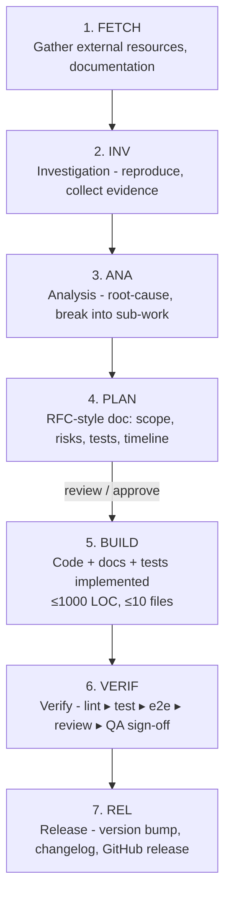

<!--
This documentation is licensed under the MIT License.
See LICENSE-MIT for details.
-->

# Agents Manifest for "Contents Feeds Reader" Repository

This repository employs a **multi-agent workflow** to automate common maintenance tasks (bug-fixing, feature work, QA, documentation, release management, …) with Large Language Models (LLMs).

This top-level document gives a bird's-eye view of all agents. Each agent has its own, more detailed, spec under `docs/agents/`. The split keeps every file < ~3000 tokens so that models can ingest them in a single context window without truncation.

## Directory Layout

```text
AGENTS.md               ── you are here (high-level overview & table of contents)
docs/
  agents/
    00_common-rules.md    ── coding conventions & shared constraints
    01_task-lifecycle.md  ── task lifecycle for repository agents (7-phase STP model)
    02_claude-code.md     ── Claude Code workflow（WBS・RACI・Guard Map） & guardrails
    phase-transition-validation.md ── Phase dependencies and transition enforcement
    git-diff-robustness.md ── Git command improvements for CI/CD reliability
    stp-validation-guide.md ── Guide for STP marker validation in PRs
    claude-code-action-guide.md ── Integration guide for Claude Code Action with GitHub
    security-guide.md     ── Comprehensive security guidelines for the plugin
    03_instruction-decomposition.md ── **IDP: Ambiguous request ⇒ WBS expansion procedure**
    developer.md          ── implementation-focused agent (a.k.a. "dev")
    reviewer.md           ── sanity/quality gatekeeper (a.k.a. "review")
    tester.md             ── unit, integration & e2e test author/executor (a.k.a. "qa")
    doc-writer.md         ── documentation agent (a.k.a. "doc")
    release.md            ── version bump, changelog & GitHub release helper (a.k.a. "rel")
    reviewer-checklist.md ── tick-box list used during VERIF gate
    glossary.md           ── Official definitions for STP terms and 7-phase model
```

### Licensing split

| Artefact type                         | Location                               | License                              |
| ------------------------------------- | -------------------------------------- | ------------------------------------ |
| Plugin runtime & tests                | `/src`, `/tests`, `/e2e`, build output | **GPL-3.0-or-later** (see `LICENSE`) |
| Process docs, templates, CI workflows | `docs/**`, `AGENTS.md`, `.github/`     | **MIT** (see `LICENSE-MIT`)          |

The permissive MIT license on documentation allows other projects to reuse the
automation workflow without impacting their code-base license, while the plugin
code itself retains strong-copyleft protection.

## Quick Facts About the Codebase

• Language & Tooling : TypeScript 5, Node ≥ 20, ESBuild, ESLint, Vitest, Playwright, Obsidian 1.8 API  
• Package manager : **pnpm** (`pnpm install`, `pnpm dev`, `pnpm build`, …)  
• Tests : `pnpm test` (all), `pnpm test:unit`, `pnpm test:int`, `pnpm e2e`  
• Lint & Format : `pnpm lint` (ESLint) / `pnpm lint:fix` (ESLint+Prettier)  
• Build : `pnpm build` (type-check + bundle to `dist/`)  
• Target IDE : Obsidian Desktop ≥ v1.8 (Electron 27)

## Agents at a Glance

| Name (handle)         | Primary Purpose                                        | Key Outputs                                        |
| --------------------- | ------------------------------------------------------ | -------------------------------------------------- |
| Developer (`dev`)     | Implement bug-fixes & features; refactor               | Patch files via `apply_patch`; concise explanation |
| Reviewer (`review`)   | Verify that a patch obeys guidelines & doesn't regress | Review comments; possible follow-up patches        |
| Tester (`qa`)         | Add and run unit / integration / e2e tests             | New/updated `*.spec.ts` or Playwright scripts      |
| Documentation (`doc`) | Keep `README`, help modals, JSDoc and diagrams current | Markdown/MDX, code comments                        |
| Release (`rel`)       | Bump version, update `CHANGELOG`, draft GitHub release | commit + release notes                             |

## Standard Task Protocol (STP)

To guarantee **repeatable, gap-free execution**, every agent MUST follow the
"STP ✧ 7-Phase Development Process" defined in
[`docs/agents/01_task-lifecycle.md`](./docs/agents/01_task-lifecycle.md). A task
cannot move to the next stage until the previous one has been **explicitly
checked-off** in the issue / PR conversation (or in the agent's commit
message). Continuous integration enforces the verification gates.

High-level summary (7-Phase STP Model):



The full checklist, acceptance criteria and required artifacts live in the
linked document.

### CLI vs GitHub PR

The same STP applies whether work is performed through the GitHub UI **or** in
an interactive Claude Code session:

- In Claude Code the agent must create / update the very same artefact files
  (`docs/rfcs/NNN-*.md`, `docs/qa/NNN-*.md`, …) using `apply_patch`.
- Checklist ticks or `State-Transition:` footers are recorded **inside those
  files** (and optionally in commit messages) – not only in transient model
  memory.
- Every turn that changes the task state should include a patch that updates
  the corresponding Markdown checklist so CI can verify it later.

### Templates

• RFC stub → `docs/rfcs/_template.md`  
• QA sheet → `docs/qa/_template.md`
• Reviewer checklist → `docs/agents/reviewer-checklist.md`

Copy-paste the template at the beginning of a task and fill the blanks. CI
steps (see `.github/workflows/stp-guard.yml`) will fail the build if required
sections are missing.

All agents inherit a common set of **rules & constraints** defined in `docs/agents/00_common-rules.md`.

## Interaction Flow (Human ⇄ Agents ⇄ Repository)

1. **Task Creation** – a user story, bug report or feature request arrives (usually a GitHub issue).
2. **Agent Dispatch** – project tooling routes the task to the most appropriate agent (`dev`, `qa`, …).
3. **Work Execution** – the agent analyses the code, edits files using `apply_patch`, and runs the relevant checks.
4. **Handoff** – once satisfied, the agent yields control. If additional scrutiny is required, the baton is passed to `review` → `qa` → `rel` in that order.
5. **Merge & Release** – after all gates pass, changes land on `main` and, if applicable, the `rel` agent publishes a new release on GitHub plus an Obsidian BRAT update.

## How to Add / Update Agents

1. Create or edit the corresponding file under `docs/agents/`.
2. Keep the file < 3 k tokens. Split further if necessary and link from a stub file.
3. Cross-link any new agent here in AGENTS.md so that the table stays up-to-date.

## Need Help?

Open an issue, ping `@mryfmo` on GitHub, or start a discussion in the Obsidian forum thread.

---

© 2024 Contents Feeds Reader.  
• **Source code**: GPL-3.0-or-later (see `license`).  
• **Documentation & agent specs** _(this folder)_: MIT – feel free to reuse in your own automation pipelines.