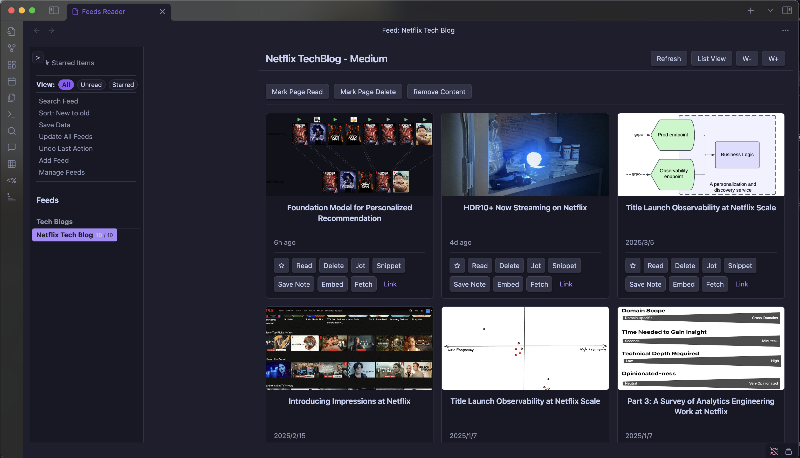
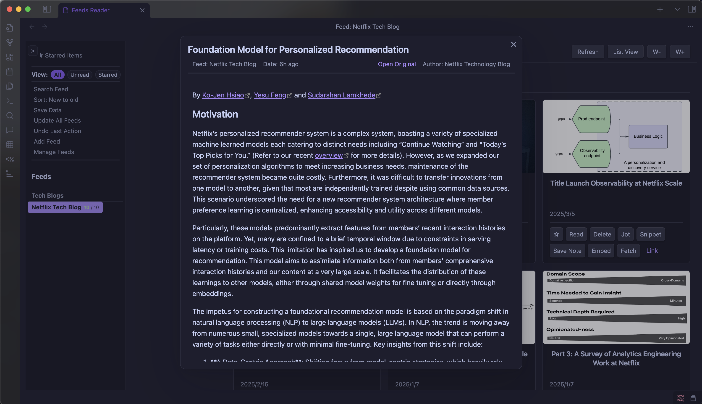

# Feeds Reader: An Obsidian plugin for reading rss feeds

This plugin is mostly built for my own use.
In the future, I plan to integrate content feeds reader with personal knowledge management.

This plugin is currently under testing and is not guaranteed to work.

## Acknowledgment

- This plugin makes use of the source code  [Feeds Reader](https://github.com/fjdu/obsidian-feed) plugin written by [Fujun Du](https://github.com/fjdu), with a few modifications.
- I personally created this, inspired by the following Reddit post: [Working on a new Obsidian plugin: RSS Dashboard – What features would you like to see?](https://www.reddit.com/r/ObsidianMD/comments/1jd5ccf/working_on_a_new_obsidian_plugin_rss_dashboard/)

## TODO

### Basic Features
- [ ] Collecting and viewing content from Podcast, YouTube, Reddit, HackerNews, Discord, Slack, and Gmail
- [ ] Adding translation functionality
- [ ] Adding Text-to-Speech functionality
- [ ] Added icons for each content type
### Extensions
- [ ] Integration with [Obsidian Web Clipper](https://github.com/obsidianmd/obsidian-clipper)
  - [ ] Automatic tagging (LLM collaboration)
- [ ] Personal knowledge management component (notes and knowledge base integration)  
  - [ ] Chat function (LLM collaboration)
