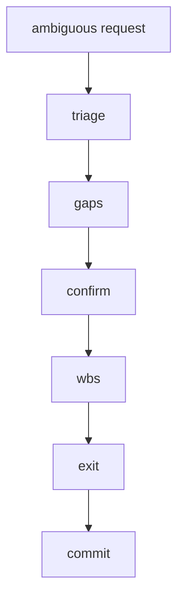

# 03 – Instruction-Decomposition Protocol (IDP) 📝➡️🗂️

> **Purpose** — To mechanically expand vague and highly granular user requests
> into *WBS ⇢ Steps ⇢ Tasks ⇢ Exit Gates* and
> to the point where the Claude Code agent can **execute and verify** them without hesitation.

---

## 0 Main flow



| Phase | Step | Task | Guard | Depends |
|-------|------|------|-------|---------|
| Triage | T-1 | Word extraction | G-TRIAGE | – |
| Triage | T-2 | Goal assumption | G-TRIAGE | T-1 |
| Gap | G-1 | List of unknown points | – | T-2 |
| Gap | G-2 | Question generation | – | G-1 |
| Confirm| C-1 | User inquiry | – | G-2 |
| Confirm | C-2 | Definitive Requirements | G-USER-OK | C-1 |
| Plan | P-1 | Draft WBS | – | C-2 |
| Plan | P-2 | ExitGate definition | G-WBS-OK | P-1 |

---

## 1 Step Details (8 steps total)

### T-1 Phrase extraction

*What* Normalize the request text and extract **nouns and verbs** → Markdown table
*Guard*: 5 or more words

### T-2 Goal assumptions

*How* Add `Assumed Goals:` section to `<think>`.
*Exit* **G-TRIAGE** — `turn_guard.sh` detects the "Assumed Goals:" line.

### G-1 List unknown points

*What* Identify gaps in the user's request that need clarification
*How* Create a table of unknowns with importance ratings (High/Medium/Low)
*Output* `gaps.md` with structured gap analysis
*Guard* At least 1 gap identified for ambiguous requests

### G-2 Question generation

*What* Convert gaps into specific, actionable questions for the user
*How* Transform each gap into a clear question with context
*Output* `questions.md` with numbered questions
*Guard* Each gap must have a corresponding question

### C-1 User inquiry

*What* Present questions to user and collect responses
*How* Display questions in a clear format, wait for user input
*Output* User responses captured in conversation
*Guard* All questions must be answered before proceeding

### C-2 Definitive Requirements

*What* Consolidate user responses into final requirements
*How* Create `final_goals.md` with confirmed goals and user acknowledgment
*Output* `final_goals.md` with "User-Ack: ✅" line
*Exit* **G-USER-OK** — File contains user acknowledgment

### P-1 Draft WBS

*What* Create Work Breakdown Structure from confirmed requirements
*How* Decompose goals into hierarchical tasks with dependencies
*Output* `draft_wbs.md` with structured task breakdown
*Guard* Each goal must map to at least one WBS item

### P-2 ExitGate definition

*What* Define completion criteria for each WBS item
*How* Add measurable exit gates and verification steps
*Output* `final_spec.md` with "Status=✅" line
*Exit* **G-WBS-OK** — All tasks have defined exit gates

---

## 2 Template

```md
### Assumed Goals
1. Implement XX
2. Pass existing tests

### Gaps
| Undetermined | Importance |
|--------|--------|
| Specification version | High |
```

---

## 3 Guard extension

| ID | Verification content | Application |
|----|----------|------|
| G-TRIAGE | `Assumed Goals:` exists in `<think>` | T-2 |
| G-USER-OK | `final_goals.md` has the line "User-Ack: ✅" | C-2 |
| G-WBS-OK | `final_spec.md` has "Status=✅" Line | P-2 |

Checked by turn_guard.sh.

---

## 4 Role-specific responsibility differences

| Role | New tasks | Restrictions |
|------|----------|------|
| dev | Triage, Gap, Plan | – |
| review | Confirm, Plan approval | RFC editing only not allowed |

---

## 5 Example: Deployment log for request "Speed ​​up ◯◯"

<!-- markdownlint-disable MD033 -->
<details>
<summary>See deployment example</summary>

```text
triage.md – 7 words extracted
gaps.md – Benchmark conditions unknown
questions.md – "Is it API or CLI?"
final_goals.md – User-Ack: ✅
draft_wbs.md – WBS draft 6 lines
final_spec.md – Status=✅
```

</details>
<!-- markdownlint-enable MD033 -->

---
