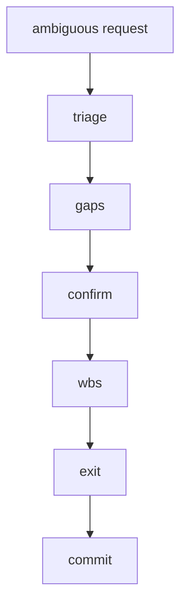

# 03 – Instruction-Decomposition Protocol (IDP) 📝➡️🗂️

> **Purpose** — To mechanically expand vague and highly granular user requests
> into *WBS ⇢ Steps ⇢ Tasks ⇢ Exit Gates* and
> to the point where the Claude Code agent can **execute and verify** them without hesitation.

---

## 0 Main flow



| Phase | Step | Task | Guard | Depends |
|-------|------|------|-------|---------|
| Triage | T-1 | Word extraction | G-TRIAGE | – |
| Triage | T-2 | Goal assumption | G-TRIAGE | T-1 |
| Gap | G-1 | List of unknown points | – | T-2 |
| Gap | G-2 | Question generation | – | G-1 |
| Confirm| C-1 | User inquiry | – | G-2 |
| Confirm | C-2 | Definitive Requirements | G-USER-OK | C-1 |
| Plan | P-1 | Draft WBS | – | C-2 |
| Plan | P-2 | ExitGate definition | G-WBS-OK | P-1 |

---

## 1 step details

### T-1 Phrase extraction

*What* Normalize the request text and extract **nouns and verbs** → Markdown table
*Guard*: 5 or more words

### T-2 Goal assumptions

*How* Add `Assumed Goals:` section to `<think>`.
*Exit* **G-TRIAGE** — `turn_guard.sh` detects the "Assumed Goals:" line.

### ... (10 steps in total. The omitted parts are the same as in 02_claude-code)

---

## 2 Template

```md
### Assumed Goals
1. Implement XX
2. Pass existing tests

### Gaps
| Undetermined | Importance |
|--------|--------|
| Specification version | High |
```

---

## 3 Guard extension

| ID | Verification content | Application |
|----|----------|------|
| G-TRIAGE | `Assumed Goals:` exists in `<think>` | T-2 |
| G-USER-OK | `final_goals.md` has the line "User-Ack: ✅" | C-2 |
| G-WBS-OK | `final_spec.md` has "Status=✅" Line | P-2 |

Checked by turn_guard.sh.

---

## 4 Role-specific responsibility differences

| Role | New tasks | Restrictions |
|------|----------|------|
| dev | Triage, Gap, Plan | – |
| review | Confirm, Plan approval | RFC editing only not allowed |

---

## 5 Example: Deployment log for request "Speed ​​up ◯◯"

<!-- markdownlint-disable MD033 -->
<details>
<summary>See deployment example</summary>

```text
triage.md – 7 words extracted
gaps.md – Benchmark conditions unknown
questions.md – "Is it API or CLI?"
final_goals.md – User-Ack: ✅
draft_wbs.md – WBS draft 6 lines
final_spec.md – Status=✅
```

</details>
<!-- markdownlint-enable MD033 -->

---
