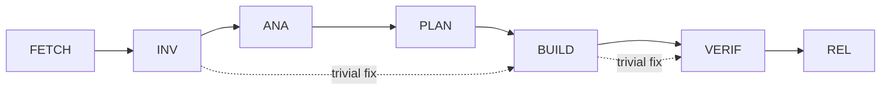

# Phase Transition Validation and Constraint Enforcement

This document defines the explicit phase dependencies, transition logic, and constraint validation for the Claude Code workflow.

## Phase Dependency Graph



## Phase Definitions with Explicit Dependencies

### FETCH Phase

```yaml
phase: FETCH
purpose: Retrieve external documents and resources
allowed_operations:
  - network_access
  - file_download
  - cache_write
depends_on: [] # Entry point - no dependencies
required_artifacts:
  - doc-list.md
  - .cache/* (downloaded files)
constraints:
  - URL validation required
  - SHA256 duplicate check (G-DUP)
  - Malicious URL blocking
  - Max download size: 10MB
validation:
  - tools/fetch_doc.sh --validate-url
  - tools/turn_guard.sh (G-DUP check)
```

### INV Phase

```yaml
phase: INV
purpose: Investigate and reproduce issues
allowed_operations:
  - run_tests
  - create_failing_test
  - document_reproduction
depends_on:
  - FETCH # If external docs needed
  - null # Can be entry point
required_artifacts:
  - fail-log.md
  - test.spec.ts (failing test)
  - docs/qa/investigation.md
constraints:
  - No fixes allowed
  - Must include "Assumed Goals" section
  - Reproduction must be verifiable
validation:
  - Test must fail (exit != 0)
  - G-TRIAGE guard check
```

### ANA Phase

```yaml
phase: ANA
purpose: Root cause analysis and impact assessment
allowed_operations:
  - code_analysis
  - impact_assessment
  - risk_evaluation
depends_on:
  - INV # Must have investigation complete
required_artifacts:
  - cause-tree.md (mermaid diagram)
  - impact.md (affected modules)
  - risks.md (FMEA table)
constraints:
  - No implementation allowed
  - All risks must have mitigations
  - Impact scope must be complete
validation:
  - G-RISK guard (all risks mitigated)
  - Reviewer approval required
```

### PLAN Phase

```yaml
phase: PLAN
purpose: Design solution and get approval
allowed_operations:
  - rfc_creation
  - test_strategy_design
  - scope_definition
depends_on:
  - ANA # Must have analysis complete
required_artifacts:
  - docs/rfcs/NNN-*.md
  - test-plan.md
  - patch-plan.md
constraints:
  - RFC format required
  - LOC estimate ≤ 1000
  - Test coverage plan ≥ 90%
  - Reviewer approval required
validation:
  - G-RFC guard (format check)
  - G-WBS-OK (all items approved)
  - 1+ reviewer thumbs up
```

### BUILD Phase

```yaml
phase: BUILD
purpose: Implement solution
allowed_operations:
  - code_modification
  - test_creation
  - documentation_update
depends_on:
  - PLAN # Must have approved plan
required_artifacts:
  - src/* patches
  - test/* patches
  - docs/* updates
constraints:
  - Maximum 1000 lines of code (G-SIZE)
  - Maximum 10 files per patch (G-SIZE)
  - All tests must pass
  - Lint/type checks must pass
validation:
  - G-SIZE guard enforcement
  - G-TEST, G-LINT, G-TYPE guards
  - CI pipeline green
```

### VERIF Phase

```yaml
phase: VERIF
purpose: Verify implementation quality
allowed_operations:
  - coverage_check
  - performance_test
  - security_scan
  - manual_qa
depends_on:
  - BUILD # Must have implementation complete
  - BUILD.artifacts.tests_pass == true
required_artifacts:
  - coverage.html (≥90%)
  - qa-results.md
  - perf-report.md
  - CHANGELOG.md update
constraints:
  - No new features
  - No breaking changes
  - All quality gates must pass
validation:
  - G-COV (coverage ≥ 90%)
  - G-PERF (no regression)
  - G-SEC (no vulnerabilities)
  - QA sign-off required
```

### REL Phase

```yaml
phase: REL
purpose: Create release
allowed_operations:
  - version_bump
  - create_release
  - tag_creation
depends_on:
  - VERIF # Must have verification complete
  - VERIF.artifacts.qa_signoff == true
  - VERIF.validation.all_passed == true
required_artifacts:
  - Version update (package.json)
  - Release notes (RELEASE.md)
  - Git tag
  - VERIF completion certificate
constraints:
  - Only after VERIF complete
  - Must have VERIF phase completion artifact
  - Semantic versioning required
  - No direct code changes
validation:
  - G-SEMVER (version format)
  - VERIF completion check
  - Release checklist complete
```

## Transition Enforcement Mechanism

### 1. Phase Completion Artifacts

Each phase must generate a completion artifact before transition:

```bash
# Example completion artifact format
cat > .phase/VERIF-complete.json << EOF
{
  "phase": "VERIF",
  "completed_at": "2024-01-15T10:30:00Z",
  "artifacts": {
    "coverage": "92.5%",
    "qa_signoff": true,
    "perf_regression": false,
    "security_issues": 0
  },
  "validation": {
    "G-COV": "PASS",
    "G-PERF": "PASS",
    "G-SEC": "PASS"
  },
  "next_allowed": ["REL"]
}
EOF
```

### 2. Transition Validation Function

Add to `tools/turn_guard.sh`:

```bash
# Phase transition validation
validate_phase_transition() {
  local current_phase="$1"
  local next_phase="$2"

  # Check if previous phase completed
  case "$next_phase" in
    INV)
      # Can start from FETCH or be entry point
      [[ "$current_phase" == "FETCH" || -z "$current_phase" ]] || \
        die "INV requires FETCH completion or new task"
      ;;
    ANA)
      [[ -f ".phase/INV-complete.json" ]] || \
        die "ANA requires INV completion artifact"
      ;;
    PLAN)
      [[ -f ".phase/ANA-complete.json" ]] || \
        die "PLAN requires ANA completion artifact"
      ;;
    BUILD)
      [[ -f ".phase/PLAN-complete.json" ]] || \
        die "BUILD requires PLAN completion artifact"
      # Check for approved RFC
      grep -q "Status=✅" docs/rfcs/*.md || \
        die "BUILD requires approved RFC"
      ;;
    VERIF)
      [[ -f ".phase/BUILD-complete.json" ]] || \
        die "VERIF requires BUILD completion artifact"
      # Check CI status
      [[ "$(cat .phase/BUILD-complete.json | jq -r .validation.CI)" == "GREEN" ]] || \
        die "VERIF requires green CI from BUILD"
      ;;
    REL)
      [[ -f ".phase/VERIF-complete.json" ]] || \
        die "REL requires VERIF completion artifact"
      # Check QA signoff
      [[ "$(cat .phase/VERIF-complete.json | jq -r .artifacts.qa_signoff)" == "true" ]] || \
        die "REL requires QA sign-off from VERIF"
      ;;
  esac
}
```

### 3. Enhanced fetch_doc.sh Validation

```bash
#!/usr/bin/env bash
# Enhanced fetch_doc.sh with security validation

validate_url() {
  local url="$1"

  # Blocklist check
  if grep -qE "(malicious|phishing|spam)" <<< "$url"; then
    die "URL blocked: suspicious domain"
  fi

  # Protocol check
  if ! grep -qE "^https?://" <<< "$url"; then
    die "Only HTTP(S) protocols allowed"
  fi

  # Size check (HEAD request)
  size=$(curl -sI "$url" | grep -i content-length | awk '{print $2}' | tr -d '\r')
  if [[ -n "$size" && "$size" -gt 10485760 ]]; then # 10MB
    die "File too large: $size bytes (max 10MB)"
  fi

  # Content-Type check
  content_type=$(curl -sI "$url" | grep -i content-type)
  if grep -qiE "(executable|binary|application/x-)" <<< "$content_type"; then
    die "Blocked content type: $content_type"
  fi
}

# Main fetch logic
fetch_doc() {
  local url="$1"
  validate_url "$url"

  # Download with timeout and size limit
  curl -L --max-time 30 --max-filesize 10M \
    --user-agent "Claude-Code-Fetcher/1.0" \
    -o ".cache/$(basename "$url")" \
    "$url"
}
```

### 4. Constraint Adjustment Recommendations

#### BUILD Phase Constraints

Current constraints may be too restrictive. Recommend:

```yaml
constraints:
  standard:
    - Maximum 1000 lines of code
    - Maximum 10 files per patch
  exceptions:
    - Refactoring: up to 2000 LOC if tests unchanged
    - Generated code: up to 5000 LOC if marked
    - Migration: up to 20 files if atomic change
  approval:
    - Exceptions require explicit reviewer approval
    - Must document reason in RFC
```

### 5. CI Integration for Phase Validation

```yaml
# .github/workflows/phase-validation.yml
name: Phase Transition Validation

on:
  pull_request:
    types: [labeled, unlabeled]

jobs:
  validate-transition:
    runs-on: ubuntu-latest
    steps:
      - uses: actions/checkout@v4

      - name: Extract phase from label
        id: phase
        run: |
          PHASE=$(echo "${{ github.event.label.name }}" | grep -oE "(FETCH|INV|ANA|PLAN|BUILD|VERIF|REL)")
          echo "phase=$PHASE" >> $GITHUB_OUTPUT

      - name: Check phase dependencies
        run: |
          # Check for required artifacts
          case "${{ steps.phase.outputs.phase }}" in
            REL)
              # Verify VERIF completion
              if ! test -f .phase/VERIF-complete.json; then
                echo "::error::REL phase requires VERIF completion artifact"
                exit 1
              fi
              ;;
          esac

      - name: Run phase-specific validation
        run: |
          ./tools/turn_guard.sh validate-phase-transition \
            "${{ steps.phase.outputs.previous }}" \
            "${{ steps.phase.outputs.phase }}"
```

## Summary of Improvements

1. **Explicit Dependencies**: Each phase now has a `depends_on` field with clear requirements
2. **Completion Artifacts**: Phases generate JSON artifacts proving completion
3. **Transition Validation**: New function in turn_guard.sh enforces dependencies
4. **Security Hardening**: fetch_doc.sh now validates URLs and content
5. **Flexible Constraints**: BUILD phase allows exceptions with approval
6. **CI Integration**: Automated phase transition validation in PRs

These improvements ensure:

- No phase can start without required dependencies
- Security risks in FETCH phase are mitigated
- BUILD constraints are practical with escape hatches
- REL phase explicitly requires VERIF completion artifact
- All transitions are auditable and enforceable
