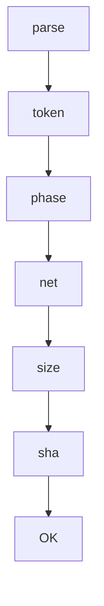

<!--
This documentation is licensed under the MIT License.
See LICENSE-MIT for details.
-->

# turn_guard design

-

## I/O Spec

| Param       | Type    | Description                         |
| ----------- | ------- | ----------------------------------- |
| `$1`        | path    | Markdown turn file                  |
| STDOUT      | text    | `"turn_guard: OK"` on success       |
| Exit        | code    | 0=pass, >0 = specific guard failure |
| Exit Code   | Guard   | Meaning                             |
| ----------- | ------- | ---------                           |
| 10          | G-PHASE | Tag order incorrect                 |
| 11          | G-TOKEN | think token out of range            |
| …           | …       | …                                   |

- shell check pass
- unit tests: `tests/guard.spec.ts`
