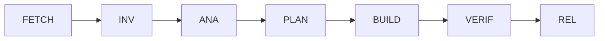

# Development Workflow - {{PROJECT_NAME}}

> **Template Version**: 1.0.0  
> **Project Type**: {{PROJECT_TYPE}}  
> **Workflow**: 7-Phase Development Process

## Quick Start Development Flow



## Phase Details

### 1️⃣ FETCH - Resource Gathering

**Duration**: 15-30 minutes  
**Purpose**: Gather all necessary documentation and context

#### Allowed Operations
- ✅ Network access via `fetch_doc.sh` or MCP fetch server
- ✅ Download documentation
- ✅ Clone repositories
- ✅ Access API documentation

#### Required Outputs
```markdown
## FETCH Phase Outputs
- [ ] All relevant documentation downloaded
- [ ] API references cached
- [ ] Dependencies documented
- [ ] Context saved to `.claude/workspace/projects/{{PROJECT_NAME}}/FETCH/`
```

#### Commands
```bash
# Using shell tools
.claude/validation/fetch-doc.sh "{{DOCUMENTATION_URL}}"

# Using MCP
mcp fetch --url "{{API_DOCS_URL}}" --output .claude/workspace/projects/{{PROJECT_NAME}}/FETCH/
```

### 2️⃣ INV - Investigation

**Duration**: 30-60 minutes  
**Purpose**: Understand the problem and reproduce issues

#### Tasks
1. Reproduce reported issues
2. Understand current implementation
3. Identify affected components
4. Document findings

#### Investigation Template
```markdown
## Investigation Report
**Issue**: #{{ISSUE_NUMBER}}
**Reproduced**: Yes/No
**Steps to Reproduce**:
1. {{STEP_1}}
2. {{STEP_2}}

**Affected Components**:
- {{COMPONENT_1}}
- {{COMPONENT_2}}

**Initial Observations**:
- {{OBSERVATION_1}}
- {{OBSERVATION_2}}
```

### 3️⃣ ANA - Analysis

**Duration**: 30-45 minutes  
**Purpose**: Root cause analysis and impact assessment

#### Analysis Framework
```markdown
## Root Cause Analysis
**Problem**: {{PROBLEM_STATEMENT}}

**Why #1**: {{WHY_1}}
**Why #2**: {{WHY_2}}
**Why #3**: {{WHY_3}}
**Root Cause**: {{ROOT_CAUSE}}

**Impact Analysis**:
- Performance: {{PERFORMANCE_IMPACT}}
- Security: {{SECURITY_IMPACT}}
- User Experience: {{UX_IMPACT}}
```

### 4️⃣ PLAN - Solution Design

**Duration**: 45-60 minutes  
**Purpose**: Create detailed implementation plan

#### RFC Template
```markdown
# RFC: {{RFC_TITLE}}
**Date**: {{DATE}}
**Author**: Claude Code
**Status**: Draft

## Summary
{{ONE_PARAGRAPH_SUMMARY}}

## Motivation
{{WHY_THIS_CHANGE}}

## Detailed Design
{{TECHNICAL_DETAILS}}

## Alternatives Considered
1. {{ALTERNATIVE_1}}
   - Pros: {{PROS}}
   - Cons: {{CONS}}

## Implementation Plan
- [ ] {{TASK_1}} ({{ESTIMATE_1}})
- [ ] {{TASK_2}} ({{ESTIMATE_2}})
- [ ] {{TASK_3}} ({{ESTIMATE_3}})

## Testing Strategy
{{TEST_PLAN}}
```

**Save to**: `docs/rfcs/RFC-{{NUMBER}}-{{TITLE}}.md`

### 5️⃣ BUILD - Implementation

**Duration**: 2-4 hours  
**Purpose**: Implement the solution

#### Build Constraints
- **Max Changes**: 1000 LOC
- **Max Files**: 10 files
- **Commit Size**: Atomic, focused commits

#### Implementation Checklist
```markdown
## Build Phase Checklist
- [ ] All tests passing before changes
- [ ] Implementation follows RFC
- [ ] Code follows project style guide
- [ ] No console.log or debug statements
- [ ] Comments added for complex logic
- [ ] Types/interfaces updated
- [ ] Error handling implemented
- [ ] Edge cases covered
```

#### Commit Message Format
```
{{TYPE}}({{SCOPE}}): {{SUBJECT}}

{{BODY}}

{{FOOTER}}
```

Types: feat, fix, docs, style, refactor, test, chore

### 6️⃣ VERIF - Verification

**Duration**: 30-60 minutes  
**Purpose**: Ensure quality and correctness

#### Verification Steps

1. **Unit Tests**
   ```bash
   {{TEST_COMMAND}}
   # Expected: All passing
   ```

2. **Integration Tests**
   ```bash
   {{INTEGRATION_TEST_COMMAND}}
   # Expected: All passing
   ```

3. **Linting**
   ```bash
   {{LINT_COMMAND}}
   # Expected: No errors
   ```

4. **Type Checking**
   ```bash
   {{TYPECHECK_COMMAND}}
   # Expected: No errors
   ```

5. **Security Scan**
   ```bash
   {{SECURITY_SCAN_COMMAND}}
   # Expected: No vulnerabilities
   ```

#### Verification Report
```markdown
## Verification Report
- Unit Tests: ✅ {{UNIT_TEST_COUNT}} passing
- Integration Tests: ✅ {{INT_TEST_COUNT}} passing
- Lint: ✅ No errors
- Type Check: ✅ No errors
- Security: ✅ No vulnerabilities
- Performance: ✅ No regressions
```

### 7️⃣ REL - Release Preparation

**Duration**: 30 minutes  
**Purpose**: Prepare for deployment

#### Release Checklist
```markdown
## Release Checklist
- [ ] Version bumped in {{VERSION_FILE}}
- [ ] CHANGELOG.md updated
- [ ] Documentation updated
- [ ] Migration guide (if needed)
- [ ] PR description complete
- [ ] Labels added
- [ ] Reviewers assigned
```

#### PR Template
```markdown
## Description
{{CHANGE_DESCRIPTION}}

## Type of Change
- [ ] Bug fix
- [ ] New feature
- [ ] Breaking change
- [ ] Documentation update

## Testing
- [ ] Unit tests pass
- [ ] Integration tests pass
- [ ] Manual testing completed

## Checklist
- [ ] Code follows style guidelines
- [ ] Self-review completed
- [ ] Comments added
- [ ] Documentation updated
- [ ] No breaking changes (or documented)
```

## Project-Specific Workflows

### {{PROJECT_TYPE}} Specific Steps

<details>
<summary><strong>Web Application</strong></summary>

#### Additional BUILD Phase
- [ ] Update API client if needed
- [ ] Check responsive design
- [ ] Test in multiple browsers
- [ ] Verify accessibility

#### Additional VERIF Phase
- [ ] E2E tests passing
- [ ] Performance benchmarks
- [ ] SEO checks
- [ ] Security headers
</details>

<details>
<summary><strong>CLI Tool</strong></summary>

#### Additional BUILD Phase
- [ ] Update command help text
- [ ] Test command aliases
- [ ] Verify error messages
- [ ] Check shell compatibility

#### Additional VERIF Phase
- [ ] Test on macOS/Linux/Windows
- [ ] Verify install process
- [ ] Check binary size
- [ ] Test offline mode
</details>

<details>
<summary><strong>Plugin/Extension</strong></summary>

#### Additional BUILD Phase
- [ ] Update manifest version
- [ ] Test in host application
- [ ] Verify permissions
- [ ] Check compatibility range

#### Additional VERIF Phase
- [ ] Test install/uninstall
- [ ] Verify no conflicts
- [ ] Check memory usage
- [ ] Test with other plugins
</details>

## Automation Support

### Phase Transition Commands
```bash
# Mark phase complete
gh issue comment {{ISSUE}} --body "Phase complete: {{PHASE}} → {{NEXT_PHASE}}"

# Update labels
gh issue edit {{ISSUE}} --remove-label "{{PHASE}}" --add-label "{{NEXT_PHASE}}"

# Generate report
tools/phase-report.sh {{PHASE}} > .claude/reports/{{PHASE}}-{{DATE}}.md
```

### Validation
```bash
# Validate phase outputs
tools/validate-phase.sh {{PHASE}}

# Check phase transition rules
tools/check-transition.sh {{CURRENT}} {{NEXT}}
```

## Common Issues and Solutions

### Issue: Tests failing in VERIF
**Solution**: 
1. Check if all dependencies are installed
2. Clear cache: `{{CLEAR_CACHE_COMMAND}}`
3. Run tests in isolation
4. Check for environment variables

### Issue: Merge conflicts in BUILD
**Solution**:
1. Rebase on latest main
2. Resolve conflicts carefully
3. Re-run all tests
4. Document conflict resolution

## Quick Commands Reference

```bash
# Development
{{DEV_COMMAND}}

# Testing
{{TEST_COMMAND}}

# Build
{{BUILD_COMMAND}}

# Lint
{{LINT_COMMAND}}

# Type Check
{{TYPECHECK_COMMAND}}
```

---

**Template Variables**: ~25  
**Customization Time**: 30-45 minutes  
**Applies to**: All project types